# GST 101: Introduction to Geospatial Technology
## Lab 2 - Spatial Data Models
### Objective – Explore and Understand Spatial Data Models

Document Version: 3/3/2015

**FOSS4G Lab Author:**
Kurt Menke, GISP
Bird's Eye View GIS

**Original Lab Content Author:**
Richard Smith, Ph.D.  
Texas A&M University - Corpus Christi

---

The development of the original document is funded by the Department of Labor (DOL) Trade Adjustment Assistance Community College and Career Training (TAACCCT) Grant No.  TC-22525-11-60-A-48; The National Information Security, Geospatial Technologies Consortium (NISGTC) is an entity of Collin College of Texas, Bellevue College of Washington, Bunker Hill Community College of Massachusetts, Del Mar College of Texas, Moraine Valley Community College of Illinois, Rio Salado College of Arizona, and Salt Lake Community College of Utah.  This work is licensed under the Creative Commons Attribution 3.0 Unported License.  To view a copy of this license, visit http://creativecommons.org/licenses/by/3.0/ or send a letter to Creative Commons, 444 Castro Street, Suite 900, Mountain View, California, 94041, USA.  

This document was original modified from its original form by Kurt Menke and continues to be modified and improved by generous public contributions.

---

### 1. Introduction

In this lab, students will explore and manage geospatial data using two modules of the FOSS4G software QGIS: QGIS Browser and QGIS Desktop. QGIS Browser is an application designed to preview and manage geospatial data. It is analogous to Windows Explorer, but works specifically with geospatial datasets. QGIS Desktop is the companion application used to perform spatial analysis and make maps.

This lab will also introduce students to the QGIS interface,  which is used throughout the course. It is important to learn the concepts in this lab as future labs will require the skills covered in this lab. 

This lab includes the following tasks:

+	Task 1 – Learn to work with QGIS Browser.
+	Task 2 – Become familiar with geospatial data models.
+	Task 3 – Viewing geospatial data in QGIS Desktop.

### 2.	Objective: Explore and Understand Geospatial Data Models

Geographic Information Systems model the real world with representations of objects such as lakes, roads and towns. Geospatial data models are the means used to represent these features. They are composed to two parts: spatial features and attributes that when combined, create a model of reality.

There are two main geospatial data models: vector and raster. 

*Vector Data Model* – best for modeling discrete objects. Vector data comes in three forms: point, line and polygon.

*Raster Data Model* – this model is best for modeling continuous objects. A raster is composed of a matrix of contiguous cells, with each cell (pixel) holding a single numeric value.

### Task 1 - Learn to work with QGIS Browser

In this task, you will become familiar with QGIS Browser. The first step in working on a project with geospatial datasets is to organize your workspace. It is important that we organize datasets logically on the computer and make them easy to find. In this task, you will obtain a copy of the lab data and explore how the data is organized using QGIS Browser.

Open QGIS Browser. The way you open QGIS Browser and QGIS Desktop will vary depending on your operating system. For this series of labs, we will explain how to open and use QGIS using the Microsoft Windows 7 operating system.

1.	Click Start | All Programs | QGIS Wien | QGIS Browser.

The interface to QGIS Browser is simple and clean (shown in the figure below). The File Tree is displayed on the left, which shows your computer's files and folders. (NOTE: your machine may have a different set and number of drives listed here. This is fine.) Below the drives are Database Connections. There are no connections to any databases at this point. The Display Window takes up the remainder of the window. There are Display Tabs above the Display Window that allow you to control the information you see.

2.	Look at the File Tree. Click the arrow to the left of the C: drive. You will now see all of the subfolders directly under the C:/ folder.
3.	Expand the lab folder where you stored your data in the File Tree by clicking the arrows to the left of each folder. You will now see the contents of the Data folder for the lab (shown in figure below).

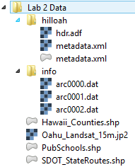

4.	Take a moment to read the names of the files. There are two folders and several files listed with different icons. The 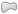 icon indicates that the dataset is a vector layer. This icon  is used to represent raster data but is also used for other files such as the XML files you see here.

### Task 2 - Become familiar with geospatial data models

Now that you are familiar with the basic layout of QGIS Browser, we will explore some geospatial data.

1.	Let’s take a closer look at these data currently listed in QGIS Browser.
2.	Select the Hawaii_Counties.shp layer in the File Tree. The Display Window automatically switches to the Metadata tab. This gives you some basic information about the dataset. You’ll notice that the Storage type is ESRI shapefile. The Display Window also tells you that it has a Geometry type of polygon and it has 9 features (shown in figure below).

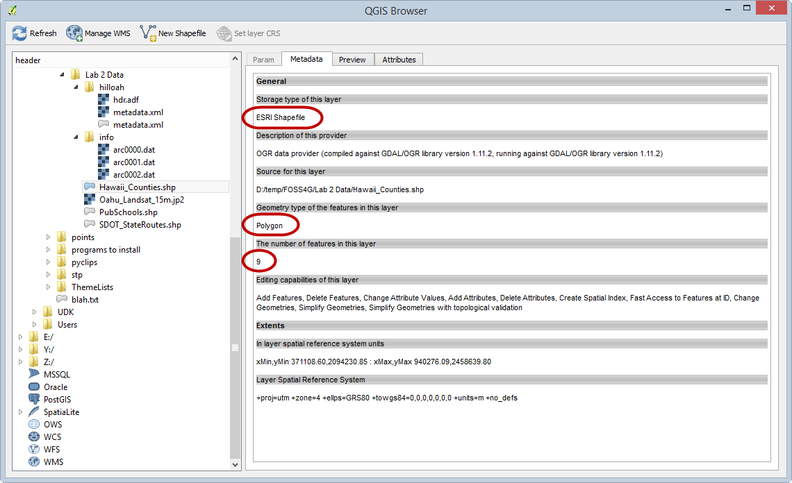

In addition to data models (vector and raster) we have to understand file formats. Some file formats are designed to store vector and others raster data. Shapefiles are vector file format. In fact they are probably the most common vector file format. An individual shapefile can only contain one geometry type (polygon, line, or point). A shapefile is actually a collection of files on the computer with a common name, but different extensions.

3.	Now select PubSchools.shp. You’ll see that this is also an ESRI Shapefile but that it is a point dataset with 287 features.
4.	Select SDOT_StateRoutes.shp. This is an ESRI Shapefile with line geometry and 122 features. 
5.	Select Hawaii_Counties.shp again and click on the Preview tab. This shows you the spatial features of this GIS dataset (shown in figure below )

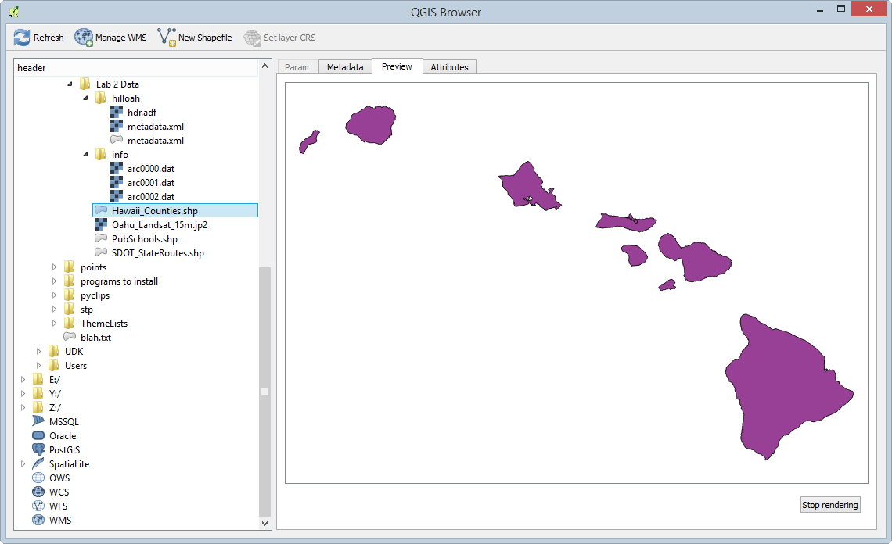

6.	Click on the Attributes tab. This shows you the other component of the data model, the attributes. Each row corresponds to one polygon. The columns are things we know about the polygons such as island name (see figure below).

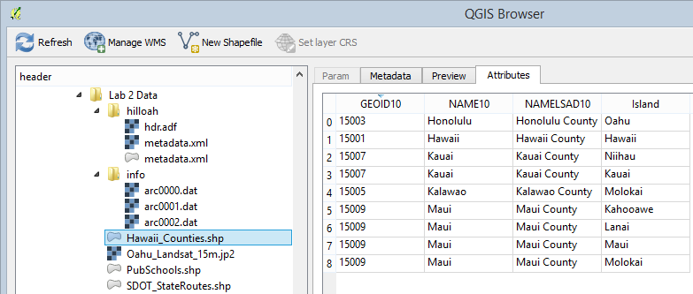

7.	Select the Oahu_Landsat_15m.jp2 dataset. Click on the Preview tab. This is an example of a raster dataset. Like a photograph, it is composed of cells. This raster is a satellite image of the island of Oahu, Hawaii (shown in figure below).

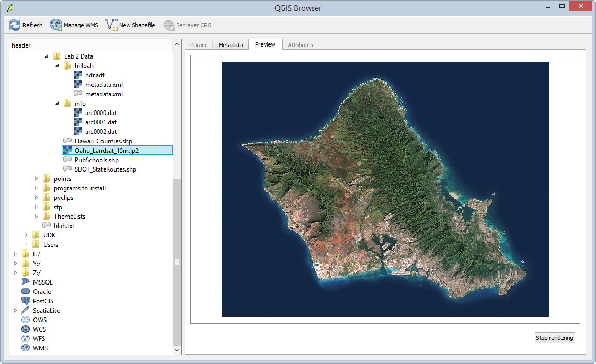

Let’s look at the file formats in more detail.

8.	Select the *Lab 2 Data* folder in the File Tree. The Param tab is all that is available when a folder is selected (see figure below). 
9.	Now the Display Window is showing you what you would see in Windows Explorer.

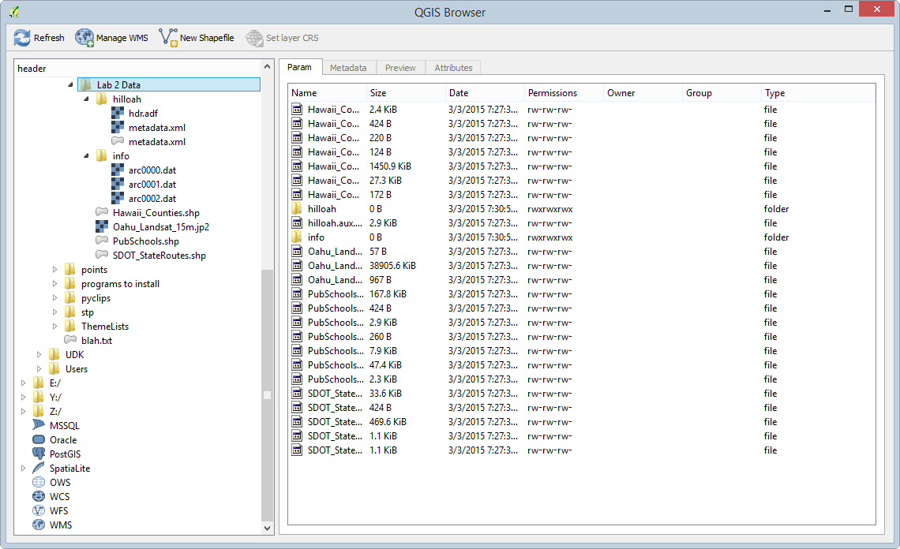

Focus on the Hawaii Counties files. Notice that the File Tree shows that Shapefile just as Hawaii_Counties.shp whereas the Display Window is showing seven files named Hawaii_Counties. These are all the component files of this particular shapefile. The File Tree simplifies the view of your data showing you only the *.shp* file. 
For more information on ESRI shapefiles refer to this link

[http://en.wikipedia.org/wiki/Shapefile](http://en.wikipedia.org/wiki/Shapefile)

### Task 3 - Viewing geospatial data in QGIS Desktop

Now that you know how geospatial datasets are stored on your computer, let’s see what the data they contain look like. This next section will introduce you to QGIS Desktop.

1. Click Start | All Programs | QGIS Wien | QGIS Desktop.
2. QGIS Desktop is the application you will use for making maps, editing data, and doing GIS analysis, among many other operations. QGIS Desktop has two main sections: the Layers panel and the Map Window.

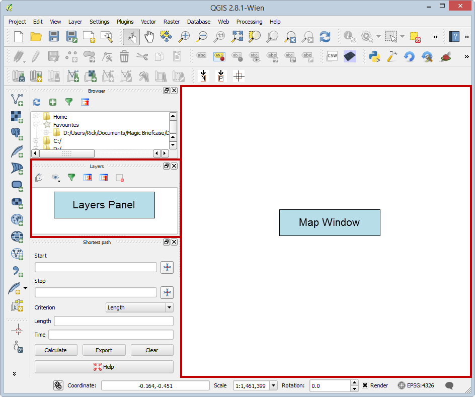

*Note:* Your QGIS Desktop window may look slightly different than the one pictured above. To reset your display back to the default settings, click Settings | Options | System tab | QSettings section | Reset button, then click OK and restart QGIS Desktop.

The QGIS Desktop interface is a little cluttered by default, so let's close a few panels so we just see the Layers panel and Map Window.

2. Locate the *Browser* panel, and click the small 'X' button in the upper-right corner to close the panel (see figure below).
2. Close the *Shortest path* panel using the same method.

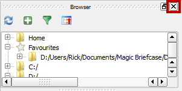

Panels can be docked and undocked from the QGIS Desktop window. To undock a panel, click and drag the panel's top title bar (outlined in figure below) and drag it away from the sides. When you release your mouse button, the panel will be floating freely.

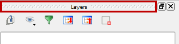

To dock a floating panel, click and drag the title bar, and drag the panel to the left or right side of QGIS Desktop until a rectangle appears underneath the panel. Release the mouse button to dock the panel (docking action shown in figure below).

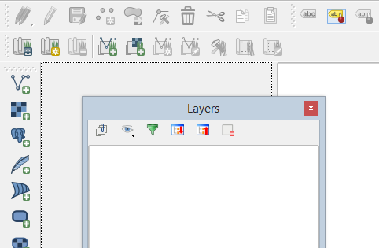

With the QGIS Desktop interface customized, let’s add some data. 

QGIS has Add Data buttons for each major geospatial data model (vector and raster).

3. Click the Add Vector Layer  button. It’s located on the toolbar along the left hand side of the Layers panel.
	+ Alternatively, you can click Layer | Add Layer | Add Vector Layer.
4. This opens the Add vector layer window. Let's add one of the ESRI shapefiles which is a file-based dataset.
5. Keep the Source type "File" which is the default. Then click the Browse button.

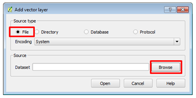

5. The *Open an OGR Supported Vector Layer* window opens. (NOTE: OGR is a FOSS4G project with the sole purpose to read and write geospatial vector data files.) The window defaults to all files. From exploring the lab data in QGIS Browser, you know there are several shapefiles in the lab data folder. Take a moment to see the other available options. Click the All files dropdown box and change to ESRI Shapefiles (shown in figure below).

6. Once you are finished exploring, make sure it is still set to ESRI Shapefiles. This filters what you can see in the lab folder so that you only see the shapefiles. 
7. Select Hawaii_Counties.shp and click Open (see figure below).

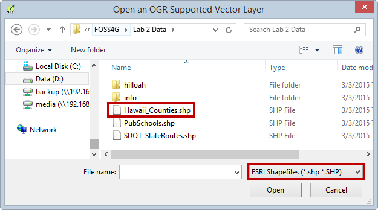

8. Now back at the Add vector layer window and click Open to add the data to QGIS Desktop (see figure below).

9. You will now see Hawaii_Counties in the Layers panel and the map features displayed in the map window. Vector GIS layers will come in with random colors. You will learn how to change layer styling in a future lab. 
10. Let’s examine the attributes. Right-click on the Hawaii Counties layer in the Layers panel. This opens a context menu. Select Open Attribute Table (shown in figure below).

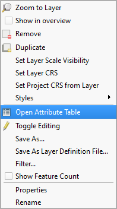

11. The attribute table opens. If you recall from exploring this dataset with QGIS Browser, it has 9 features (9 polygons). The attribute table has 9 corresponding records. There are columns with the County name (NAMELSAD10) and with the Island name (Island). Close the Attribute Table by clicking the X button in the upper right hand corner.

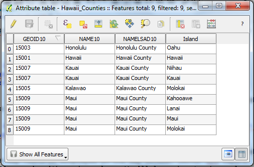

12. Another way to interact with both the spatial features and the attributes is the Identify button.
13. Click the Identify button 
14. Click on one of the features on the map. The Identify results panel (shown in figure below) shows you the attributes for the feature you clicked on. *Note:* The Identify results panel may initially be docked or floating.

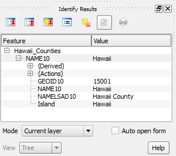

Now you will learn how to add Raster data to QGIS Desktop.

1. Click the Add Raster Layer button 
	+ Alternatively, click Layer | Add Layer | Add Raster Layer.
2. The Open a GDAL Supported Raster Data Source window opens (displayed in figure below). This is a very similar workflow to adding vector data.

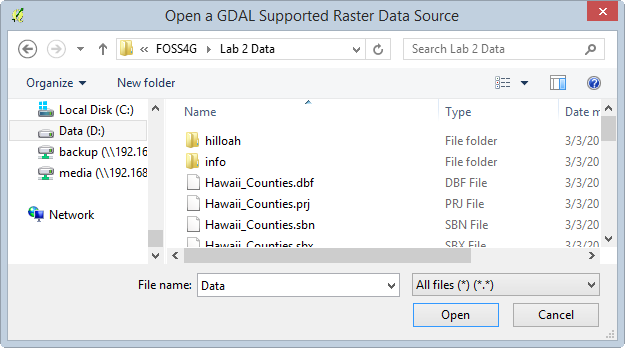

3. Whereas QGIS used OGR to open vector data files, here it uses another FOSS4G software library called GDAL. GDAL is used for reading and writing raster datasets. 
4. The window’s raster data filter is set to All Files by default, so you see the entire contents of the folder (Figure below).

![[GDAL] All Files](figures/[GDAL]_All_Files.png "[GDAL] All Files")

5. Set the filter to JPEG2000. (Also, note how many formats it will read!) In GIS there are many more raster file types than vector. Once you’ve set the filter you’ll see the one dataset: Oahu_Landsat_15m.jp2 (shown in figure below).

![[GDAL] JPEG 2000](figures/[GDAL]_ERDAS_JPEG_2000.png "[GDAL] JPEG 2000")

6. Select the Oahu_Landsat_15m.jp2 raster dataset and click Open.
7. This dataset only covers a portion of Hawaii, just the island of Oahu. Right-click on the Oahu_Landsat_15m dataset in the layers panel and choose Zoom to Layer to zoom to the spatial extent of this raster (shown in figure below).

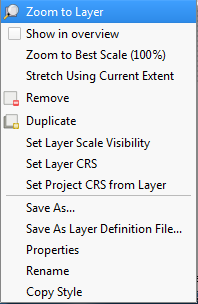

You may notice two folders in the lab data folder that we have not discussed yet. One is named *hilloah* and the other *info*. Together, these combine to make another geospatial raster dataset format named GRID.  The info folder holds the attributes and always has the name "info". The other folder is the layer name and contains the spatial data. Let's add a GRID raster to our map.

8. Click the Add Raster Layer button again.
9. Set the filter to Arc/Info Binary Grid. Double click the hilloah folder to enter it. Select the hdr.adf file and click Open to add the raster to QGIS (shown in figure below).

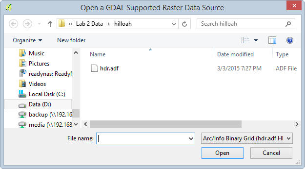

10. This raster is a hillshade image of Oahu and it represents the terrain.

QGIS Desktop also has a Browser panel that allows us to view geospatial files on our computer without having to open QGIS Browser.

1. Right-click on the blank space to the right of the Help menu. This opens a context menu showing all the toolbars and windows that you can add to the QGIS interface. Check the box next to Browser (shown in figure below). A Browser panel is added to QGIS Desktop (likely located under the Layers panel).

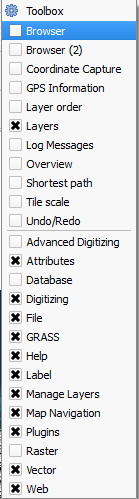

2. Look at the Browser panel. Note that there is a Favourites item. Identify folders or locations as being Favourites in order for them to appear here. 

Data is often stored deep inside a series of folders. It is often tedious and time consuming to navigate deep inside the folders to gain access to the data. Favourites provide a way to create a shortcut directly to any folder so that you have one-click access to any folder. Let's create a favorite to our lab folder for practice.

4. Navigate to the lab data folder in the Browser panel. Right-click on it and choose Add as a Favourite (see figure below). *Note:* Currently this functionality is reserved only for the Browser tab in QGIS Desktop. However, once it is set it will show up as a Favourite in QGIS Browser as well.

5. Now expand Favourites and you will see your lab folder listed there. You can remove a favourite anytime by right-clicking on it and choosing Remove favourite.
6. Expand the lab folder under Favourites to expose the contents. Select SDOT_StateRoutes.shp and drag it onto the map. This is a quick way to add data to your map. 

*Note:* You can drag data from the QGIS Browser application to QGIS Desktop as well to add the data to the map. 

### 5 - Conclusion

In this lab you explored datasets that use the two common geospatial data models: vector and raster. You have also used the QGIS Browser to preview datasets. In future labs, you will learn how to use QGIS Desktop to make maps and perform analysis. 

### 6 - Discussion Questions

1. What are the 14 possible file extensions for files that compose a shapefile?
2. How can Browser favourites make your workflow more efficient?
3. What are the two main parts of a GIS data model?
4. Name three ways of seeing feature attributes for a vector GIS layer.