# GST 101: Introduction to Geospatial Technology
## Lab 3 - Understanding Coordinate Systems and Map Projections
### Objective – Explore and Understand Coordinate Systems and Map Projections

Document Version: 3/3/2015

**FOSS4G Lab Author:**
Kurt Menke, GISP
Bird's Eye View GIS

**Original Lab Content Author:**
Richard Smith, Ph.D.  
Texas A&M University - Corpus Christi

---

The development of the original document is funded by the Department of Labor (DOL) Trade Adjustment Assistance Community College and Career Training (TAACCCT) Grant No.  TC-22525-11-60-A-48; The National Information Security, Geospatial Technologies Consortium (NISGTC) is an entity of Collin College of Texas, Bellevue College of Washington, Bunker Hill Community College of Massachusetts, Del Mar College of Texas, Moraine Valley Community College of Illinois, Rio Salado College of Arizona, and Salt Lake Community College of Utah.  This work is licensed under the Creative Commons Attribution 3.0 Unported License.  To view a copy of this license, visit http://creativecommons.org/licenses/by/3.0/ or send a letter to Creative Commons, 444 Castro Street, Suite 900, Mountain View, California, 94041, USA.  

This document was original modified from its original form by Kurt Menke and continues to be modified and improved by generous public contributions.

---

### 1. Introduction

In this lab, the student will explore the effects of various map projections on the characteristics of a map using QGIS.  QGIS is a free and open source geographic information system software package that can be used to visualize, query, and analyze spatial information.

This lab will focus primarily on shape and area distortions and will examine projections useful for mapping on the global scale as well as on the national and state level.

This lab includes the following tasks:

+ Task 1 – Setting Map Projections and Coordinate Systems in QGIS Desktop
+ Task 2 – Exploring World Map Projections
+ Task 3 – Exploring National Map Projections
+ Task 4 – Exploring State Map Projections
+ Task 5 - Exploring the Universal Transverse Mercator (UTM) Coordinate System

### 2. Objective: Explore and Understand Map Projections and Coordinate Systems

The map projection is a fundamental part of the mapping process, and provides the backbone, or framework, for the map.  It is important for the GIS Specialist to understand the qualities of the mapped region that are preserved by a given projection, and the qualities that will be distorted or skewed. Additionally, for cartographers, selection of an appropriate map projection is a crucial part of the map design process. This is because we are all used to seeing different parts of the world mapped using specific standard projections that make these areas “look right”. 

The transformation of the ellipsoid shape of the earth onto a two-dimensional surface cannot be accomplished without some element of distortion, through shearing, tearing, or compression (as discussed in the text).  For mapping small Earth areas (large-scale mapping), projection is not a major issue, but as the scale becomes smaller, as in the mapping of continents or subcontinents, distortion becomes a significant factor.  Distortion of area, shape, distance, and direction become properties to consider.  It is impossible for one projection to maintain all of these properties simultaneously.  

Projections are classified according to the properties they preserve.  Equal-area (or equivalent) maps, for example, preserve area relationships, but tend to lose conformality (preservation of shape).  Conformal projections, on the other hand, maintain shape over small areas but produce areal distortion. In thematic mapping, it is important to maintain correct area properties. Therefore, shape is at times compromised through the choice of an equivalent projection.  For small-scale maps, in fact, conformality cannot be maintained over the entire area; rather, the projection may preserve shape best along a standard line, with shape distortion increasing with distance from the line.  Another property to consider is distance preservation (equidistance), which preserves distance measurements along great circle arcs.  Finally, direction preservation (azimuthality) maintains correct direction from one central point to all other points. 

There are hundreds of possible projections from which to choose.  Some distort less in certain ways than others.  It is up to the map designer to select the projection that produces the least amount of unwanted distortion.  Many computer mapping software packages now allow the GIS specialist to easily switch between various projections, allowing the choice of the one most appropriate.  In the selection of a projection, several key elements must be considered:

+ Projection properties - Are the properties of the projection suitable to the map’s purpose? Considering the properties of shape, distance, direction, and area, which ones must be preserved, and which can be sacrificed?  Or is compromise of all four the best choice?
+ Deformational patterns - Is the amount of deformation acceptable?
+ Projection center - Can the projection be centered easily on the area being mapped?
+ Familiarity - Is the appearance of the map recognizable to the map reader or will it detract from the map’s purpose?

###	Task 1 - Setting Map Projections and Coordinate Systems in QGIS

In this task, you will explore the effects of various projections on the characteristics of a map.  We will focus primarily on shape and area distortions.  We will examine projections useful for mapping on the global scale.

In Lab 2 you added data to QGIS Desktop. Here you will open an existing QGIS project.

1. Open QGIS Desktop.  
2. In QGIS Desktop, open the project, World View.qgs by clicking Project | Open.  You should see the map shown in Figure below.

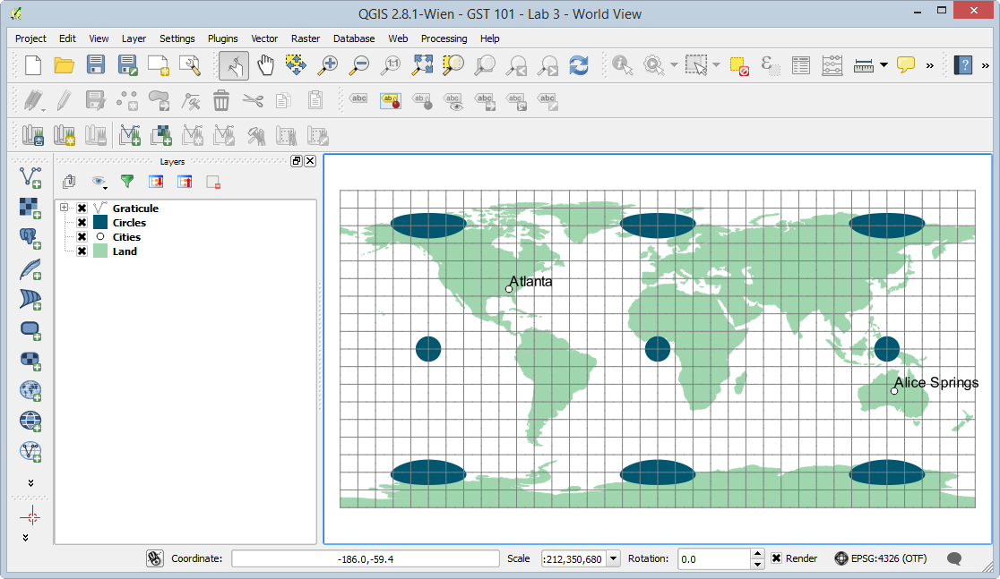

WorldView.qgs is a QGIS project file.  A project file contains information about a map such as: list of layers, coordinate system, symbols, labels, custom tools, map elements, and much more.

An individual GIS layer in the Table of Contents is known as a theme. In the project file, there are two polygon themes, Circles and Land, a point theme, Cities, and a line theme, Graticule.  If these circles were displayed on a globe they would be perfect circles. Here you can begin to visualize the distortion in the projection by the distortion in the Circles theme. On this map, a projection has not been chosen in QGIS Desktop.  The software is using latitude and longitude measured in geodetic decimal degrees, which displays a simple rectangular coordinate system in which the length of one degree of longitude is consistently equal to one degree of latitude.  In QGIS Desktop, when a projection has not yet been selected, distance calculations remain true, since the software computes distance using the spherical coordinates of latitude and longitude along a great circle arc, just as if you were actually measuring at the Earth’s surface.  Although a projection has not yet been chosen by the user, the display is essentially a Plate Carrée projection.  On a projection that preserves shape, the polygons on the Circles theme appear as true circles.  In a Plate Carrée projection, linear scale, area, and shape are all distorted increasingly toward the poles as demonstrated with the Circles theme.  

The circles will be used in this exercise for illustrating the areal and shape distortion that occurs with various projections.  While this method does not actually quantify the distortion, as does Tissot’s indicatrix, it does visually demonstrate the skewing, tearing, and shearing that occurs with certain projections.

First we will examine the map units and distance units set for this “unprojected” map.

4. From the menu bar, select Project | Project Properties.
5. Click the CRS tab to view the Coordinate Reference System information for the project file (shown in figure below).

Notice that the selected coordinate system is set to WGS 84, which is an unprojected coordinate system.

6. Click Cancel to close the Project Properties dialog box.

Now we will do some distance measurements on this map for later comparison to maps in which a projection is set.

7. Click on the Measure Line tool, , on the Attributes toolbar.  The Measure box will appear (Figure below).

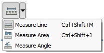

8. Click on the point for Atlanta, in the United States.  

9. Move the cursor to the point for Alice Springs, Australia, then right-click to end the line.  The distance between Atlanta and Alice Springs will be displayed in metric in the Measure box (Figure below).

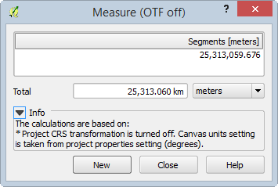

The measured distance is about 25,300 kilometers (your distance may vary slightly).  This is not the actual distance between Atlanta and Alice Springs.  Since on the fly CRS transformation is turned off, QGIS measures directly between Atlanta and Alice Springs (along your measure line) heading East from Atlanta.  What it should do is measure to Alice Springs by heading West from Atlanta instead of East as you defined since heading West is a shorter distance than heading East.  However, QGIS does not know that the “World is round,” so-to-speak, since on-the-fly transformation (OTF) is turned off.  With OTF turned on, it treats the coordinate system as a selected World-based coordinate system.  This view does not maintain spherical distance measurements, and distorts shape, direction and area.

Let’s tell QGIS that we are, in fact, working with a World-based coordinate system and wish to measure on a round world.

10. From the menu bar, select Project -> Project Properties.

11. Click on the CRS tab.

12. Check the “Enable ‘on the fly’ CRS transformation” option.

13. Select the WGS 84 coordinate system from the list of Coordinate reference systems of the world (Figure below).

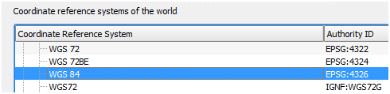

14. Click OK to view the map.

15. Using the Measure tool, measure the distance between Atlanta and Alice Springs again (Figure below).

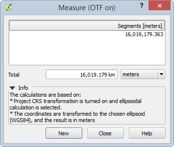

The measured distance is about 16,000 kilometers (your distance may vary slightly).  This is the actual  distance between Atlanta and Alice Springs.  This view maintains spherical distance measurements, but distorts shape, direction, and area.  

Let’s change the projection on this view to the Mercator projection.

16. Open the Project Properties and select the CRS tab.

17. In the Filter box, type in 3395, which is the EPSG code for the WGS 84 / World Mercator projected coordinate system.  This filters the long list of Coordinate Reference Systems so we can easily find the one we are searching for.

EPSG Codes are unique codes for each projection/coordinate system. To learn more about EPSG codes, visit [http://www.epsg.org/](http://www.epsg.org/).

18. Select WGS 84 / World Mercator from the filtered Coordinate Reference System list (Figure below).

19. Click OK to view the map.  You should see the map shown in Figure below.

The Mercator projection, a conformal  projection (except at the poles), has straight meridians and parallels that intersect at right angles.  Scale is truest along the equator, and becomes more distorted at higher latitudes, as evidenced by the increasing size of the circles.  The Mercator projection was designed for marine navigation and gives all straight lines on the map as lines of constant compass bearing.  For global scale thematic maps, however, the Mercator has too much areal distortion for accurate use.  

The Mercator is best for larger scale projections of areas at low latitude. Small-scale maps have much distortion of area and distance.

The Mercator map is much less desirable for mapping continents than other projections as it has significant distortion and can promote geographical misconceptions.  In general, rectangular maps are not recommended for use in mapping the world.  Equivalency (the property of equal area) and conformality are better preserved using non-rectangular maps. Task 2 will examine a map projection more suitable for mapping the world.  

Keep the World View QGIS project open, it will be used in Task 2 as well.

### Task 2 - Exploring World Map Projections

Let’s examine a map projection more suitable for mapping the entire world: the Eckert IV projection.  The Eckert II map projection is an equal-area pseudocylindrical map projection with straight parallel latitude lines and equally spaced meridians.

Let’s change the projection on this view to the Eckert IV projection.

1. Open the Project Properties and select the CRS tab.

1. In the Filter box, type in Eckert.  This filters the long list of Coordinate Reference Systems so we can easily find the one we are searching for by name.

2. Select Eckert IV/World\_Eckert\_IV from the filtered Coordinate Reference System list.

3. Click OK to view the map.  You should see the map shown in Figure below. 
	+ *Note:* Due to occasional rendering issues, the projected map may look "blocky". If this happens, either zooming in, or temporarily switching the CRS to another CRS and back will sometimes fix the issue.

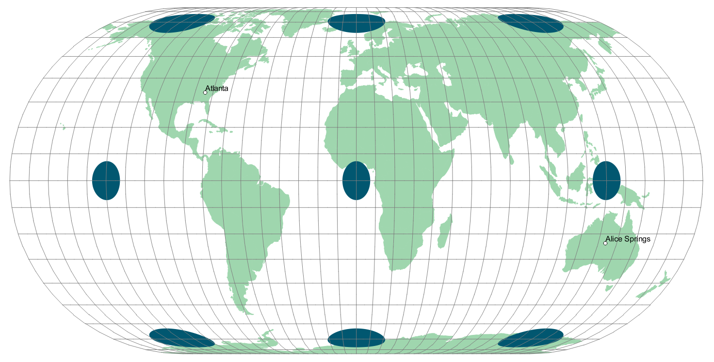

The Eckert IV is useful for world maps as it is equal-area and is pleasing to the eye.  Its standard parallels are at 40° 30’N and 40° 30’S.  This map is only distortion free where the standard parallels intersect the central meridian.

Let’s see how the distance property fares.

4. Using the Measure tool, measure the distance from Atlanta to Alice Springs.

The distance measures approximately 20,848 kilometers.  The Eckert IV is therefore not an equidistant projection and should not be used for distance measurement.

### Task 3 - Exploring National Map Projections

Projections suitable for mapping the world are not necessarily the best for mapping smaller areas, such as continents or countries. When mapping at such a scale in the mid-latitudes it is important to use a projection that centers on the area being mapped and has a standard line, or lines, passing through the area being mapped.

In this task, we will look at a map of the contiguous United States using a few different projections. 

1. In QGIS Desktop, open the project, Country View.qgs (Figure below) by clicking Project | Open.

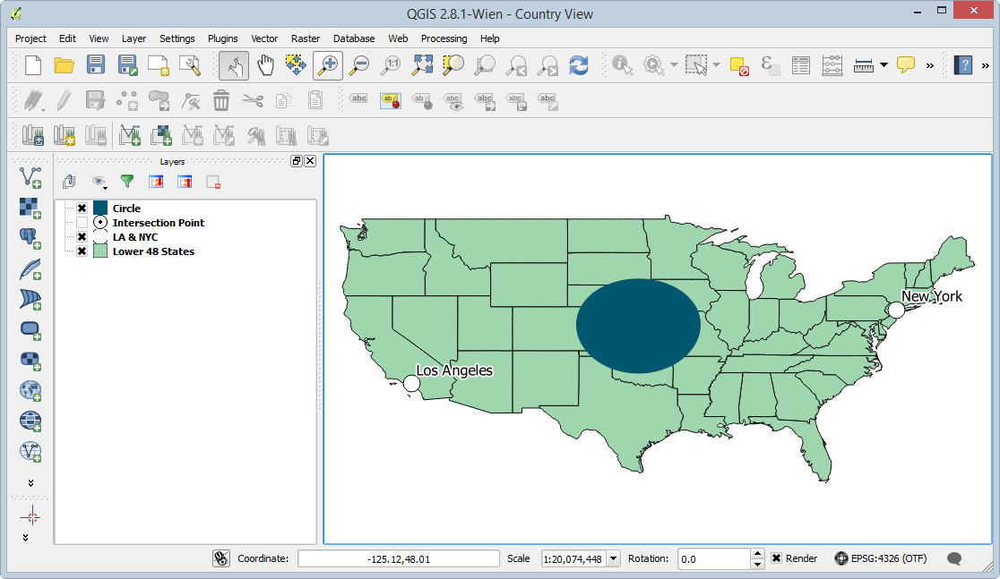

Country View.qgs is an unprojected map of the lower 48 states comprised of three themes: United States, LA & NYC, and Circle (centered on -97.50, 39.00).  You can see it does not look quite right given the default projection.  The circle shows some obvious skewing.  

The distance property is more difficult to judge.  The known distance between Los Angeles and New York is approximately 3,962 kilometers.  Let’s see how the unprojected map controls distance distortion.

2. As before use the Measure Tool to measure the distance between Los Angeles and New York City in kilometers.

If OTF is off, the distance in the unprojected view returns an answer 44.8 meters! If you receive this short distance, enable on-the-fly CRS transformation so the correct distance will be returned. 

3. From the menu bar, select Project | Project Properties.

4. Click on the CRS tab.

5. Check the “Enable ‘on the fly’ CRS transformation” option.

6. Select the WGS 84 coordinate system from the list of Coordinate reference systems of the world (Figure below).

7. Click OK to view the map.

8. You may need to right click on the Lower 48 States them and choose Zoom to Layer Extent.

9. Measure the distance between Los Angeles and New York again.

The measurement will now be virtually the same as the actual distance of 3,962 kilometers.  Remember, for this projection in QGIS, coordinates are treated as spherical latitude and longitude.  Distance is calculated as if along a great circle arc and so the actual ground distance is preserved.  Shape and areal properties, however, are distorted.

Now we will project the data using the Eckert IV projection.  The Eckert IV did a nice job with the whole world, but we will see how it fares with a single mid-latitude country.

10. Open the Project Properties, select the CRS tab, and choose World\_Eckert\_IV from the recently used coordinate reference systems box.

11. Click OK to set the CRS.  You may need to zoom full  to see the lower 48 states (Figure below).

There clearly is a great deal of distortion using this projection, most obviously the shearing.  Part of the problem lies in the fact that this projection is centered at 0 degrees longitude.  Let’s center the projection on the United States by creating a custom CRS based on the World\_Eckert_IV projection.

11. Click Settings | Custom CRS… from the menu bar.  This will open the Custom Coordinate Reference System Definition dialog box.

12. Click Copy existing CRS button  to open the Coordinate Reference System Selector.  

13. Select World\_Eckert\_IV from the recently used list.  Make sure that the CRS parameters show at the bottom of the selector.  If not, temporarily select a different CRS, then select World\_Eckert\_IV again (see Figure below).

14. Click OK to return to the Custom CRS Definition dialog.  The Parameters will now be filled with the copied CRS parameters (shown in figure below).

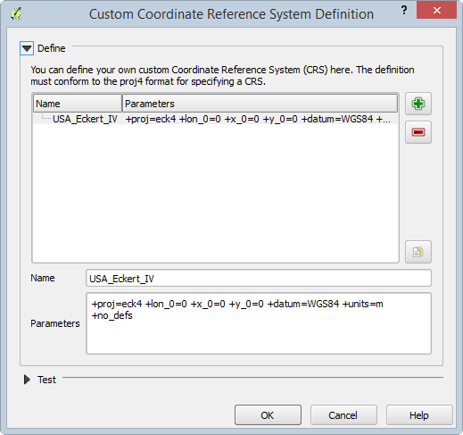

We need to change the central meridian so that the projection is centered at -96.000 degrees longitude instead of 0.000.  This will center the projection down the middle of the country.  

15. To accomplish this, replace lon\_0=0 with lon\_0=-96.0 (essentially replacing the central meridian of 0 with -96.0).  The CRS Parameters should now look like:

*+proj=eck4 +lon\_0=-96.0 +x\_0=0 +y\_0=0 +datum=WGS84 +units=m +no\_defs*

16. In the “Name” box, enter USA\_Eckert\_IV.  This will serve as a name of our new Custom CRS.

17. Click OK.

Our custom CRS is now added to QGIS Desktop for us to use.  Let’s choose our USA\_Eckert\_IV projection to see how it projects our map.

18. Open the Project Properties, select the CRS tab.

19. In the ‘Coordinate reference systems of the world’ list, scroll all the way to the bottom until you see 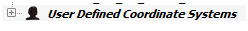

20. Expand the User Defined Coordinate Systems entry.

21. Choose USA\_Eckert\_IV.

22. Click OK to set the CRS. You may need to zoom full  to see the lower 48 states (Figure below).

This is a distinct improvement in shape, but there is still some skewing.  The Eckert IV projection is primarily used for mapping the entire world.  For mapping large countries, at mid-latitudes, such as the United States, other projections are more appropriate.  

The Lambert azimuthal, Albers equal-area, Bonne equal-area, and Lambert conformal conic projections are examples of suitable projections for mapping the entire U.S.  

Because it has two standard parallels, the Albers equal-area projection is particularly good for larger countries with a significant east-west extent.  Let’s try Albers on our map.

23. Once again, open the Project Properties, select the CRS tab, and choose USA\_Contiguous\_Albers\_Equal\_Area\_Conic (EPSG: 102003) as the CRS.

24. Click OK to set the CRS. You may need to zoom full  to see the lower 48 states (Figure below).

The Albers conic projection has low scale distortion for an area the size of the U.S.  As the area being mapped decreases in size, distortion is less of an issue.  

Let’s try another map projection to see what changes.

25. Open the Project Properties, select the CRS tab, and choose USA\_Contiguous\_Lambert\_Conformal\_Conic (EPSG: 102004) as the CRS.

26. Click OK to set the CRS. You may need to zoom full  to see the lower 48 states.

Not too much changed between Albers and Lambert.  They are both similar map projections.  Lambert does have more options in its CRS parameters list, so let us examine the custom options so we can more fully understand what options can be set when creating a custom CRS.

27. Click Settings | Custom CRS… from the menu bar.  This will open the Custom Corodinate Reference System Definition dialog box.

28. Click Add new CRS button .

29. Click Copy existing CRS button  to open the Coordinate Reference System Selector.  

30. Select USA\_Contiguous\_Lambert\_Conformal\_Conic from the recently used list.  Make sure that the CRS parameters show at the bottom of the selector.  If not, temporarily select a different CRS, then select USA\_Contiguous\_Lambert\_Conformal\_Conic again.

31. Click OK to copy the parameters.

32. Change the Name to Modified\_USA\_Contiguous\_Lambert\_Conformal\_Conic.  Your Custom CRS Parameters should look like Figure below.

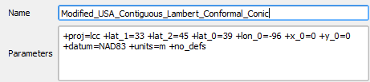

33. Click on Project | Project Properties and change the maps projection to the newly created Modified\_USA\_Contiguous\_Lambert\_Conformal\_Conic

There are many ways that we can customize this CRS.  You can customize one of the projection selections so that it is centered on the area in question, in this case the United States, simply by redefining the particular cartographic settings, such as the central meridians, standard parallel(s), reference latitude, or false eastings and northings.  The choice of parameters varies depending on which projection is being used.  

Let’s briefly define these terms and where they can be modified in the CRS Parameters.  Each term will be followed by the parameter in the CRS Parameters inside of parenthesis. 

*Note:* Proj.4 is another FOSS4G project used by QGIS, like OGR and GDAL. This project is for managing coordinate systems and projections. For a detailed user manual for the Proj.4 format used to specify the CRS Parameters in QGIS, visit

[ftp://ftp.remotesensing.org/proj/OF90-284.pdf](ftp://ftp.remotesensing.org/proj/OF90-284.pdf)

+ False easting (x\_0) - in QGIS, the x-coordinate value for the x-origin.  For example, if the central meridian for your projected map is -96.00, and the false easting is set to 0.00, then all locations along that meridian are assigned a value of 0.00.  All locations to the west of the central meridian (x-origin) are assigned a negative value, and all locations to the east of the central meridian are assigned a positive value, as in a typical Cartesian plane.

+ False northing (y\_0) - in QGIS, the y-coordinate value for the y-origin.  For example, if the reference latitude for a conic projection is 37.00, then all locations along that parallel are assigned a value of 0.00.  All locations to the south of the reference latitude (y-origin) are assigned a negative value, and all locations to the north of the reference latitude are assigned a positive value, as in a typical Cartesian plane.

+ Central meridian (lon\_0) - the longitude on which a map is centered (x-origin).

+ Standard parallel(s) (lat\_1, lat\_2) - the latitude on which a map is centered (sometimes the y-origin), or for conic projections, the parallels along which the cone touches the earth.

+ Latitude of Origin (lat\_0) - the latitude on which a map is centered (y-origin).

For now, we will leave the default settings for the central meridian, latitude of origin, standard parallels, and false easting and northing.  In setting map projections, the choice of spheroid, or reference ellipsoid, is also an important consideration.  In this example, the spheroid is currently set to GRS\_1980. 

+ Spheroid (ellps) - a model of the earth’s shape used in transforming a projection.  The reference spheroid, or ellipsoid, is generated by choosing the lengths of the major and minor axes that best fit those of the real earth.   Many such models are appropriate for different locations on the earth.

Closely related to the concept of the spheroid is the concept of the datum.  The North American Datum of 1927 (NAD27) uses the Clarke 1866 reference ellipsoid, whereas the North American Datum of 1983 (NAD83) uses the Geodetic Reference System (GRS) 1980 reference ellipsoid.
 
+ Datum (datum) - selecting and orienting a specific spheroid to use for a location.

+ Coordinate Units (units).  Coordinate Units are used to define distances when setting x and y coordinates.  

Now let’s see the effect of the 0.00 settings for the false easting and northing.  The x-origin is approximately -95.85 and the y-origin is approximately 37.16. 

You may have noticed that GIS layers (aka. “themes”) in the Layers panel have a box with an X in it. Layers can be turned off and on by unchecking and checking that box.  

42. In the Layers panel, turn off the Circle layer by clicking the X, to see southeastern Kansas, the location where the x and y origins intersect.
43. Turn on the Intersection Point layer by clicking the empty box to the left of the name and turning on the X, to see where the x and y origins intersect.

In Figure below, a white circle with a centered, black dot illustrates the intersection of the x and y origins.  At this intersection in the view, the x and y coordinates are 0.00, 0.00.  As you move to the northeast, both the x and y coordinates are positive.  You can view the coordinates of your mouse cursor in the bottom-right corner of QGIS. The figure below shows an example.

The values of the x and y coordinates are expressed in meters from the origin.  As you move to the southwest of the intersection, the x and y coordinates are both negative.  Experiment with the changing coordinate values and other projections on your own.

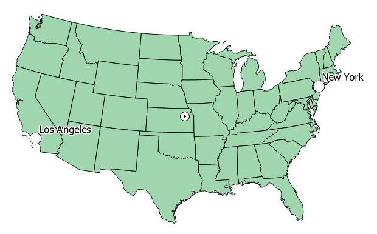

The conic projections function quite well for mapping the larger states in the U.S.  In terms of thematic mapping, it is important that maps at this scale are equal-area.  Any other properties important to the particular map should also be considered when selecting a proper projection.  We will now examine projections and grid systems for large-scale maps, such as for small states, counties, or local regions.

###	Task 4 - Exploring State Map Projections

The State Plane Coordinate System (SPCS) was developed to provide a simple rectangular coordinate system for large scale mapping use (i.e. small areas of the earth), such as surveying and engineering projects.  

The SPCS is a series of separate coordinate systems, each covering either an entire state, or a portion of a state.  The SPCS is only used in the United States of America and, therefore, it is not appropriate to use SPCS for other countries or regions of the World.  SPCS is popular due to its high accuracy in large-scale mapping because of the relatively small size of each SPCS zone.  The SPCS is composed of 120 zones which follow county boundaries (except in Alaska) and often divides a state in to multiple zones. There are two main projections used with the SPCS. States with a north-south axis are mapped using the Transverse Mercator projection, and designate zones with between a range of ‘North’ and ‘South’ (e.x. Minnesota North).  States with an east-west axis are mapped with the Lambert Conformal projection and designate zones between a range of  ‘East’ and .West’ (e.x. New Mexico Central).

The original state plane system, developed in the 1930s, was based on the North American Datum of 1927, with coordinates measured in feet.  Today the state plane system is based on the North American Datum of 1983, and coordinates are in meters. 

The coordinate grids cover small areas with minimal areal or distance distortion.  For small states, one grid is sufficient, while for larger states, more are required to cover the entire area.  Alaska, for example, needs ten grids.  The state plane system, therefore, is only appropriate for mapping small Earth areas, such as the smallest states, city grids, or local regions. Your study area will need to fit within a State Plane Zone for this to be an appropriate choice of coordinate system. The smallest states, which only have one state plane zone, can be represented in their entirety using the SPCS.

Let’s create a map display of Vermont, using the State Plane Coordinate System.  Vermont is one of the smaller states and only has one state plane zone.

1. In QGIS, open the project, Vermont.qgs by clicking Project | Open.

2. Open the Project Properties then click on CRS tab.

Note that the projection selected is WGS 84.  This is selected because the Vermont shapefile is the only layer, is projected in the WGS 84 coordinate system, and first added layer in the map, so QGIS sets the project’s coordinate system to match.  Also note that on the fly CRS transformation is not enabled, therefore, we are seeing Vermont in an unprojected state.  

To make the map of Vermont in SPCS, we have two options:

+ Enable 'on the fly' CRS transformation, and select NAD27 / Vermont coordinate system, EPSG: 32045.

+ Project the Vermont shapefile in to NAD27 / Vermont and set the Project’s coordinate system to match.

Enabling on the fly CRS transformation will allow us to work with data that are in different map projections in the same QGIS Project.  However, sometimes it is best to project the data in to the coordinate system we wish to map at, since it will have the advantages of not requiring QGIS to calculate the transformation on the fly, and analysis operations will be more predictable and accurate.

So, let us project the Vermont shapefile in to the NAD27 / Vermont coordinate system and set the Project coordinate system to match.

3. In the Layers panel, right-click on the Vermont layer and from the context menu choose Save As…  This will open the ‘Save vector layer as…” dialog box (Figure below).

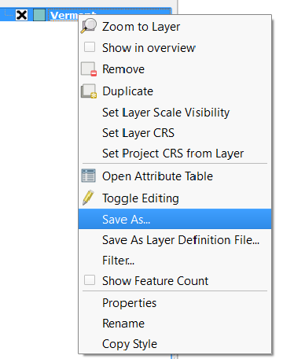

4. Set the following options to project the Vermont layer, save it to a new shapefile, and add it to the map (Figure below shows correct options).
	
	a. Format: ESRI Shapefile
	
	b. Click Browse

	c. Find your Lab 3 "Data" Folder and save within that folder under the name *Vermont\_SPCS.shp*

	d. CRS: NAD27 / Vermont (EPSG:32045)  (click Select CRS button  to select CRS)

	e. Add saved file to map: selected. Your dialog should now look like the one in the figure below.

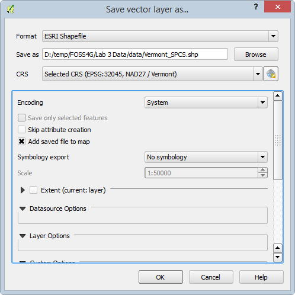

5. Click OK.  QGIS will project the Vermont layer and add it to the map.  It will look like Figure below, but the color of the newly-added Vermont layer may differ. Remember that styling is random on layers added to QGIS.

So far, Vermont looks the same, but you will find out why soon.  First, let’s make the Vermont\_SPCS layer look the same as the Vermont layer.

6. Open the Project Properties, select the CRS tab.

Notice that on the fly CRS transformation is enabled (remember, it was not enabled before) and WGS 84 is the project's current CRS.  This happened because QGIS realized that layers in the project had different CRS.  With on the fly CRS transformation enabled, the two Vermont layers still display on top of each other.  If on the fly CRS transformation was not enabled, the two Vermont layers would not display on top of each other or, even, on the same map at all!  If you wish to modify the behavior of QGIS and its automatic management of on the fly CRS transformations, you can set the behavior options by clicking Settings | Options | CRS tab from the main QGIS menu bar.

Let us now change the project CRS to match our SPCS Vermont shapefile.  First, we will set the style of the SPCS Vermont to match the WGS 84 Vermont.

7. Click OK to close the Project Properties.

8. Right-click on Vermont in the Layers panel, and select Styles | Copy Style.  This copies the style definition of this layer.

9. Right-click on Vermont\_SPCS in the table of contents and select Styles | Paste Style. This sets the style of this layer based on the previously copied style.

10. Right-click on Vermont\_SPCS and choose Set Project CRS from Layer from the context menu.  

You should now see that Vermont got ‘skinnier’ as it is not being displayed in the NAD27 / Vermont SPCS and not WGS 84.

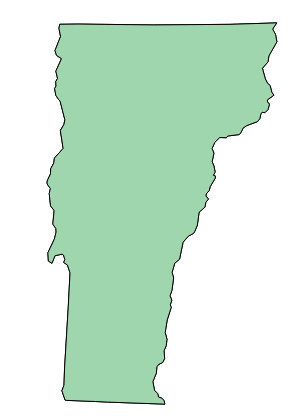

11. Open the Project Properties, select the CRS tab.  Notice that on the fly CRS transformation is still enabled, but now NAD27 / Vermont is now the selected CRS.

Look at the Selected CRS Parameters at the bottom of the properties window (shown in figure below).  Note that the projection used is Transverse Mercator (proj=tmerc) and the scale factor is (k=0.999964286).  The spheroid is Clarke 1866, however this is not shown in the CRS Parameters because the default spheroid is Clarke 1866 if not specified (otherwise, it would be specified as ellps=clrk66).  The central meridian is -72.5 (lon\_0=-72.5), which runs through the center of the state.  The reference latitude, or y-origin, is 42.5 (lat\_0=42.5), which is just south of Vermont.  The false easting is set to 152,400.30480 meters (x\_0=152400.3048006096), which is equivalent to 500,000 feet.  The false northing is set to 0.00 (y\_0=0).  So, the false origin will be to the west (500,000 feet west of -72.5) and south (42.5) of the state of Vermont.

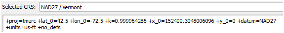

11. Click OK to close the Project Properties.

GIS layers can be removed from the Layers panel (and map window) as easily as they were added. For example, we do not need the original Vermont layer. We can just work with the version of Vermont in SPCS. To remove a layer simply right click on it within the Layers panel and choose Remove from the context menu. A confirmation dialog will appear. Click the OK button to confirm the removal of the layer.

12. Remove Vermont from the Layers panel (not Vermont\_SPCS!). 

Scroll around the state and notice the changing coordinates.  If you have a USGS topographic map of any part of Vermont, based on NAD27, the coordinates displayed here will match the UTM coordinates shown on the hardcopy map.

### Task 5 - Exploring the Universal Transverse Mercator (UTM) Coordinate System

The Universal Transverse Mercator (UTM) grid (shown in the figure below) is a plane coordinate system that spans almost the entire globe.  It is probably the best known plane coordinate system of international scope.  For the UTM system, the globe is divided into sixty zones, each comprised of six degrees of longitude. Each zone has its own central meridian. The limits of each zone are 84 degrees north and 80 degrees south.  UTM uses the Transverse Mercator projection.  The zones are numbered 1 to 60, where zone 1 begins at -180° Longitude and zones increase heading East back to +180° where zone 60 ends.

13. There are separate versions of both the Country View and World View QGIS project files with a UTM Zone polygon theme. In each QGIS project document, the UTM theme is labeled with the UTM zones so you can see what zones cover your part of the country. 
14. These QGIS project documents are named World View UTM.qgs.and Country View UTM.qgs
15. Using what you have learned in this lab, experiment with the putting these UTM World and Country View maps into the UTM system.
16. Open up one of these projects. (for example: Project | Open | Country View UTM.qgs)
17. Once the map opens, from the Project menu choose Project Properties and open the CRS tab. 
18. Via the Filter, search for UTM. Choose a UTM zone in your part of the country to put the map into. There are UTM definitions with different datums. Choose one from the NAD83 UTM zone projection series. 

*Note:* Many U.S. federal agencies use this system, such as the U.S. Forest Service and the U.S. Bureau of Land Management. Like the State Plane Coordinate System it is important that your study area fit within a UTM zone. 
For more information on the UTM Coordinate system, read the USGS Fact Sheet 077-01, available at

[http://pubs.usgs.gov/fs/2001/0077/report.pdf](http://pubs.usgs.gov/fs/2001/0077/report.pdf)

### 3. Conclusion

In this lab, you have explored coordinate systems and map projections.  Each map projection distorts the Earth differently.  You are able to modify the map projections provided in QGIS to suite your mapping needs.  It is important that you set the correct map projection for each data layer, and for the project.  

When you import spatial data into QGIS, you must know the projection, if any, the grid system, and the datum, of your data.  Mostly you will find the data in decimal degrees, that is, latitude and longitude coordinates.  Base maps with underlying coordinates that are geodetic decimal degrees are the most versatile when constructing a map database.  It is important that if you plan on doing any spatial analysis with your data, that you first project the data in to the same coordinate system to get maximum accuracy.

### 4. Discussion Questions

1. Based on the world map projections covered in this lab, which industries would best be served by each projection (provide two examples)?  Does the entire industry need to agree on a single one?  What problems could arise from the use of different projections?

2. Can your GIS data be in a different Coordinate Reference System than your QGIS project? Explain.

3. What UTM zone does Nevada fall into?