# GST 101: Introduction to Geospatial Technology
## Lab 4 - Displaying Geospatial Data
### Objective – Explore and Understand How to Display Geospatial Data

Document Version: 3/10/2015

**FOSS4G Lab Author:**
Kurt Menke, GISP
Bird's Eye View GIS

**Original Lab Content Author:**
Richard Smith, Ph.D.  
Texas A&M University - Corpus Christi

---

The development of the original document is funded by the Department of Labor (DOL) Trade Adjustment Assistance Community College and Career Training (TAACCCT) Grant No.  TC-22525-11-60-A-48; The National Information Security, Geospatial Technologies Consortium (NISGTC) is an entity of Collin College of Texas, Bellevue College of Washington, Bunker Hill Community College of Massachusetts, Del Mar College of Texas, Moraine Valley Community College of Illinois, Rio Salado College of Arizona, and Salt Lake Community College of Utah.  This work is licensed under the Creative Commons Attribution 3.0 Unported License.  To view a copy of this license, visit http://creativecommons.org/licenses/by/3.0/ or send a letter to Creative Commons, 444 Castro Street, Suite 900, Mountain View, California, 94041, USA.  

This document was original modified from its original form by Kurt Menke and continues to be modified and improved by generous public contributions.

---

### 1. Introduction

In this lab, students will learn how to complete a well-designed map showing the relationship between species habitat and federal land ownership. The student will learn how to style GIS data layers in QGIS Desktop. They will then learn how to use the QGIS Print Composer to design a well crafted map deliverable. The final map will include standard map elements such as the title and map legend.

This lab will also continue to introduce students to the QGIS interface, as QGIS Desktop will be used throughout the course. It is important to learn the concepts in this lab as future labs will require the skills covered in this lab. 

This lab includes the following tasks:

+	Task 1 – Add data, organize map layers and set map projections.

+	Task 2 – Style data layers.

+	Task 3 – Compose map deliverable.

###	2. Objective: Create a Map that Meets the Customer’s Requirements

Often times, you will be provided with a map requirements document from a coworker or customer. For this lab, the student will respond to a map requirements document from a customer who is writing a paper about the state of Greater sage-grouse habitat in the western United States. The map requirements from the customer are below.

Map Requirements from Customer:

Hi, my name is Steve Darwin. I am a wildlife biologist writing a paper on the state of Greater sage-grouse (Figure below) populations in the western United States. I need a letter sized, color, map figure that shows the relationship between current occupied Greater sage-grouse habitat and federal land ownership. I am interested in seeing how much habitat is under federal versus non-federal ownership.

I have been provided data from the US Fish and Wildlife Service depicted current occupied range for Greater sage-grouse. I also have federal land ownership, state boundaries and country boundaries from the US National Atlas. The land ownership data has an attribute column describing which federal agency manages the land (AGBUR). 

I want to have the habitat data shown so that the federal land ownership data is visible beneath. I would like each different type of federal land styled with standard Bureau of Land Management colors. The map should also include a title (“Greater sage-grouse Current Distribution”), a legend, data sources and the date. The map should be a high-resolution (300 dpi) jpg image.

I trust that you will get the figure right the first time, so please just submit the completed figures to the managing editor directly.

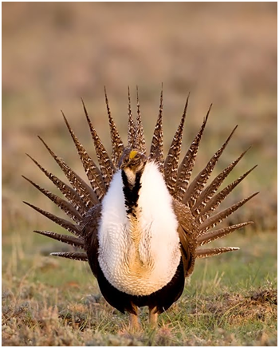

### Task 1 Add Data, Organize Map Layers and Set Coordinate Reference System

In this first task you will learn a new way to add data to QGIS Desktop. You will then set the projection for the map project, organize the data layers in the Table of Contents and change the layer names.

2. Open QGIS Desktop 2.6.  

In Lab 2 you learned how to add data to QGIS Desktop by using the Add Vector Data and Add Raster Data buttons. Now you’ll learn another method of adding data to QGIS Desktop. You’ll use the QGIS Desktop Browser tab.

3. Select the Browser tab at the bottom of the Table of Contents (Figure below).
NOTE: If the Browser tab is not there right click on the blank space to the right of the Help menu. This opens a context menu showing all the toolbars and windows that can be added to the QGIS Desktop interface. Check the box next to Browser. 
The Browser tab is added to the Table of Contents .

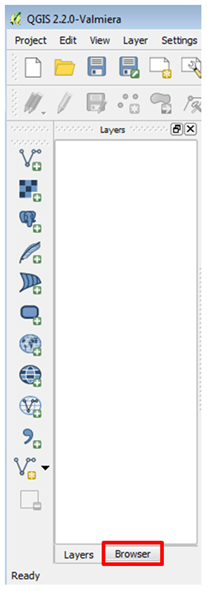

4. Using the file tree in the Browser window navigate to the Lab 4 data folder. 

5. Right click on the Lab 4 data folder and choose Add as a favourite from the context menu.

6. When recent changes have been made, such as setting a folder as a favourite, the Refresh button needs to be used in order to see the changes. Click the Refresh button (Figure below).

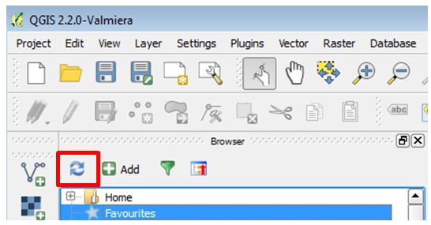

7. Now expand Favourites near the top of the file tree in the Browser window by clicking the plus sign to the left. You will see the Lab 4 data folder listed. Setting the folder as a favourite allows you to quickly navigate to your working folder.

8. You will see 5 shapefiles in the lab data folder:

 +	Canada.shp

 +	Land_ownership.shp

 +	Mexico.shp

 +	Sage_grouse_current_distribution.shp

 +	Western_states.shp

9. You can select them all by holding down the Ctrl key on your keyboard while left clicking on each shapefile. Select the five shapefiles (Figure below).

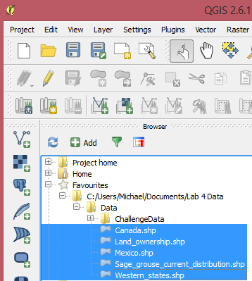

10. You can select them all by holding down the Ctrl key on your keyboard while left clicking on each shapefile. Select the five shapefiles (Figure above).

11. While holding the Ctrl key down drag the five selected shapefiles onto the map canvas. This is another way of adding geospatial data to QGIS Desktop. QGIS Desktop should now look like Figure below. The random colors that QGIS assigns to the layers may be different than Figure below but that is fine

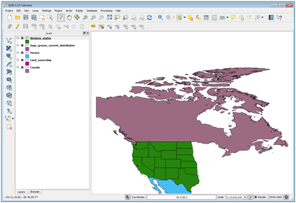

12. Now Right click into an empty space at the top of the tool bar and check layers to switch to the view of your map layers.  (Figure below).

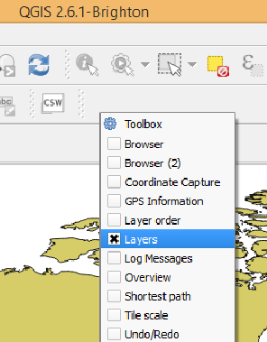

13. Save your map. Click on Project -> Save from the menu bar. Navigate to your Lab 4 folder and save your project as Lab 4 (Figure below).

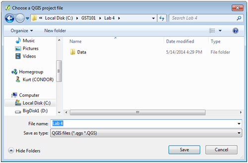

14. We have five layers but currently all we can see are data for Canada, Mexico and the Western states. When you cannot see a dataset one approach is to make sure the spatial extent of your map window covers that dataset. Right click on the Sage_grouse_current_distribution and choose Zoom to Layer Extent from the context menu. This will zoom you into the extent of that dataset.

15. That zooms you into the western United States but you still cannot see anything that looks like habitat data (Figure below).

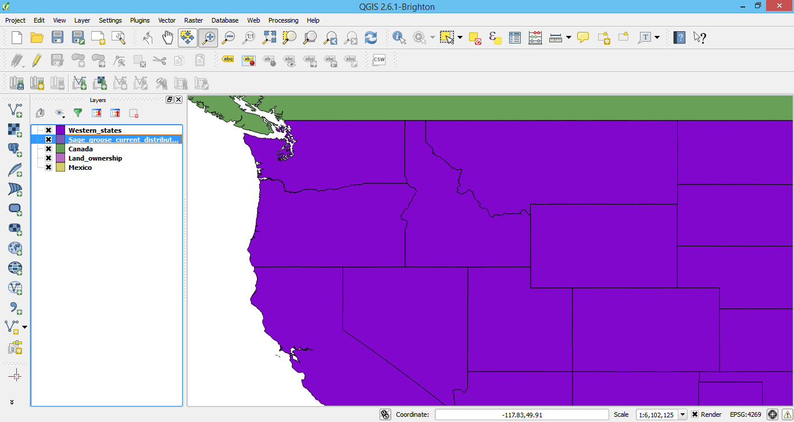

The data layers in the table of contents are drawn in the order they appear in. So the layer that is on the top of the list in the Table of Contents will be drawn on top of the other layers in the map view. Notice that the Western_states layer is in that top position. This mean that Western_states is covering up the Sage_grouse_current_distribution and Land_ownership data. 

16. You can change this drawing order. Select the Land_ownership data layer in the Table of Contents and drag it to the top position. You will see a blue line as you drag this layer up the list.

17. Your map should now look like Figure below.

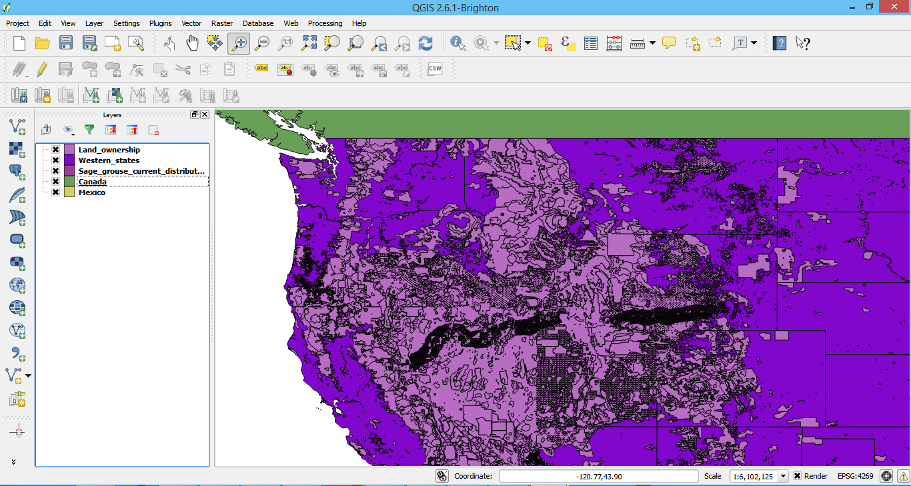

18. Now drag the Sage_grouse_current_distribution layer into the top position. Your map should now resemble Figure below. Now all the data layers should be in the correct order. Typically, data layers will be organized with point data layers on top of line layers on top of polygon layers. Raster data layers are usually placed near the bottom. There are always exceptions however.

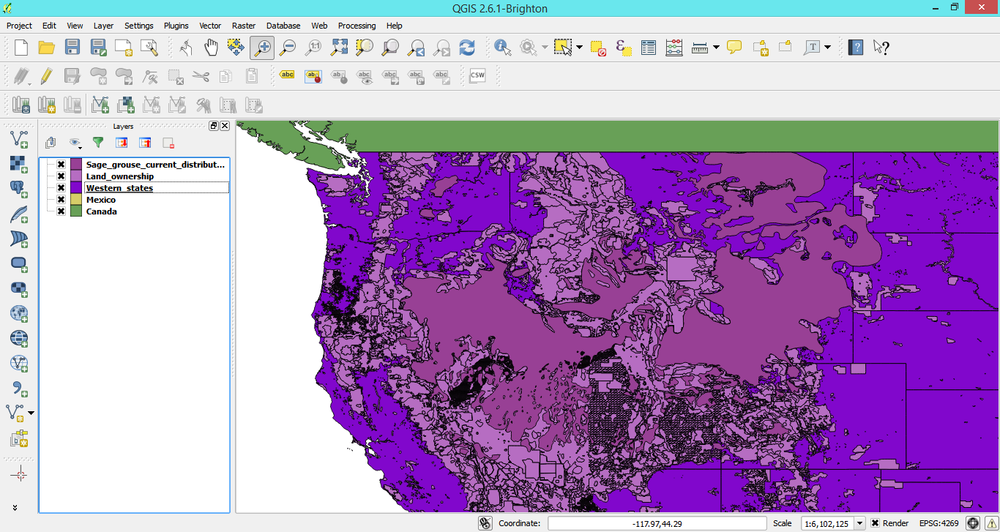

19. Next you will set the coordinate system for the map. Note that the lower left hand corner of QGIS reads EPSG: 4269. This is the EPSG code for the coordinate reference system (CRS) the map is currently in (Figure below).

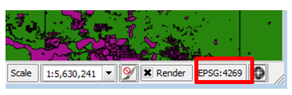

20. Click on Project -> Properties from the menu bar to open the Project Properties window. Select the CRS tab. The current QGIS map CRS is listed at the bottom (Figure below). This is a fuller explanation of the maps CRS which is a geographic coordinate system using the NAD83 datum. This CRS makes the lower 48 look stretched out and distorted so you’ll want to change the maps CRS into something that makes the lower 48 “look correct”. Make sure that the Enable ‘on the fly’ CRS transformation option is checked. Click OK to close the Project Properties window.

Since the Sage_grouse_current_distribution layer is in an Albers projection, and the QGIS map is in a geographic CRS, that means that the Sage_grouse_current_distribution layer, is being projected on the fly into the geographic projection of the map.

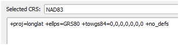

21. Right click on the Sage_grouse_current_distribution layer and choose Set Project CRS from Layer option on the context menu (Figure below). This will put the map into the Albers CRS of the Sage grouse layer. Note that the EPSG code in the lower right corner now reads 5070 for the Albers CRS. This CRS gives the western US an appearance we are more used to. Any other map layers not in Albers, will now be projected on the fly into Albers.

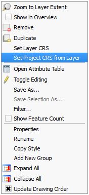

22. Now you will change the layer names in the Table of Contents. The layer names match the names of the shapefiles by default. However, these names will appear on the legend. So you will always want to change these to proper names that your map reading audience will understand.  Right click on the Sage_grouse_current_distribution layer, and choose the Properties from the context menu, to open the Layer Properties window. Choose the General tab on the left.  Click in the box next to Layer name and change the name to Sage-grouse Habitat (Figure below). Click OK to close the Layer Properties window.

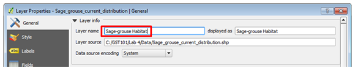

23. Change the other layers as follows:

<table>
<thead>
<tr>
  <th>Current Layer Name</th>
  <th>New Name</th>
</tr>
</thead>
<tbody>
<tr>
  <td>Land_ownership</td>
  <td>Federal Land Ownership</td>
</tr>
<tr>
  <td>Western_states</td>
  <td>State Boundaries</td>
</tr>
</tbody>
</table>

24. Click the Save button to save the changes you’ve made to your project (Figure below).

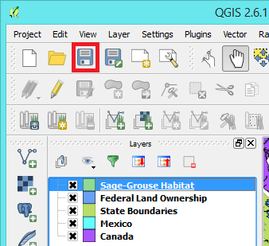

Task 2  Style Data Layers

Now that you’ve set up your map you’ll style your layers and begin to craft a well designed map.

1. Visually you’ll want the land ownership and sage-grouse habitat to have the most weight. Canada and Mexico are there for reference but should fall to the background. You’ll make them both light gray.

2. Double click on the Canada layer to open the Layer Properties window. This is another way to open Layer Properties. 

3. Click on the Style tab.

4. In the Symbol layers box click on Simple fill (Figure below).

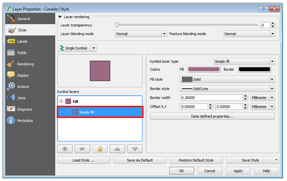

5. Find the Symbol layer type box on the right side of the window. This allows you to change both the fill and outline symbols for this polygon layer. Click on the colored box to the right of Fill to open the Select Color window. 

6. You can pick existing Basic colors or define a color via A) hue, saturation and value (HSV) or B) red blue and green (RGB) values. Set the color to Hue: 0 Sat: 0 and Val: 90. Make your Select Color window match Figure below. Click the Add to Custom Colors button to save this color. Click OK to close the window.

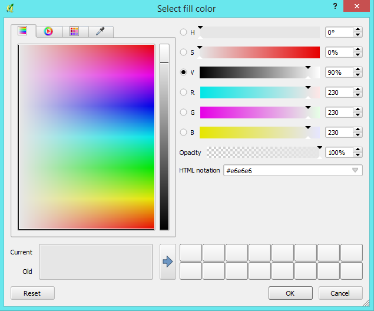

7. Click OK on the Layer Properties window to close and style the Canada layer.

8. Open Layer Properties for Mexico. Make Mexico the same color as the Canada layer. You can just choose the Custom color you just saved.

9. Your map should now look like Figure below.

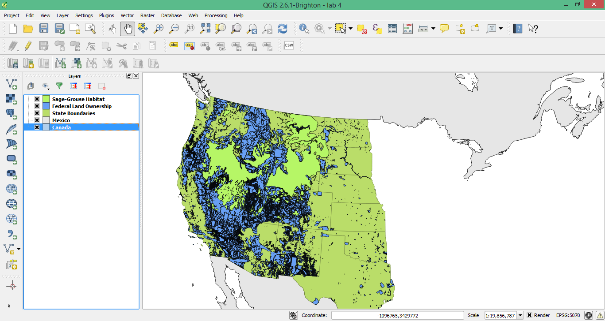

10. Using the same workflow give the State Boundaries a white fill. You’ll be able to find white in the Basic colors palette.

11. Now you’ll style the Land Ownership layer. Instead of making the entire layer one color as you’ve done thus far, you’ll assign a unique color to each land managing agency. How do you know who is managing each parcel? This will be information contained in the attribute table. Right click on Land Ownership and choose Open the Attribute Table from the context menu. There are 13 column of information (Figure below). Can you find the one that contains the land manager?

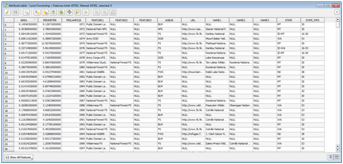

12. Open the Layer Properties for Land Ownership to the Style tab. So far you’ve used the default Single Symbol type. Now you’ll switch to Categorized. Click the drop down menu and change from Single Symbol to Categorized (Figure below).

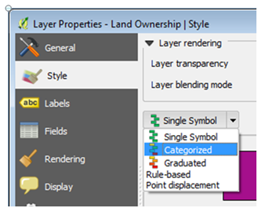

13. Now you have the option of choosing an attribute column to symbolize the layer by. The column AGBUR is the one that contains the managing agency values. Click the drop down arrow and choose AGBUR for the Column. Then click the Classify button (Figure below). This tells QGIS to sort through all the records in the table and identify all the unique values. Now you can assign a specific color to each.

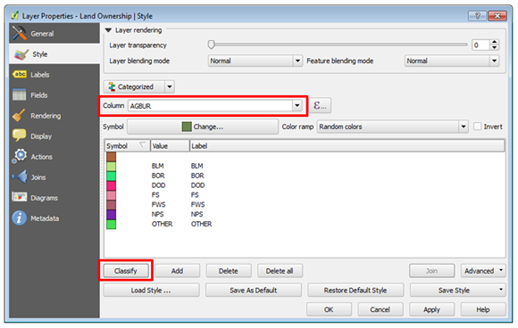

14. Notice that there is a symbol with no values. These are parcels with no values (NULL) in the AGBUR field. They represent private and state inholdings within federal lands. Since you’re just interested in depicting federal land ownership you’ll delete that symbol class. Select that top symbol by clicking on it, and then click the Delete button below to remove that symbol. Now those parcels will not be included on the map.

For the remaining federal land ownership symbols you’ll use the BLM Standards Manual for land ownership maps [http://www.blm.gov/noc/st/en/business/mapstandards/colormod.html](http://www.blm.gov/noc/st/en/business/mapstandards/colormod.html). They have designated colors for each type of land ownership. When composing a map it is important to pay attention to industry specific standards. Following them will make the map more intuitive to the target audience. For example, people are used to seeing Forest Service land depicted in a certain shade of green.

15. To color BLM lands double click on the color patch left of BLM in the Style window. The Symbol selector will open. Click on Simple fill. You won’t want any border lines on these polygons. With such a complicated thematic polygon layer they are too visually distracting. Choose a Border style of No Pen. Then click on the color patch right of Fill (Figure below) to open the Select Color window.

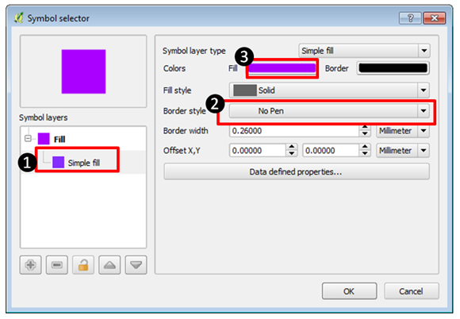

16. In the Select Color window change the Red, Green and Blue values to 254 – 230 – 121 (Figure below). This will change the color to a specific shade of tan representing BLM lands. Click OK in the Select Color window. Then click OK in the Symbol Selector to save the BLM style.

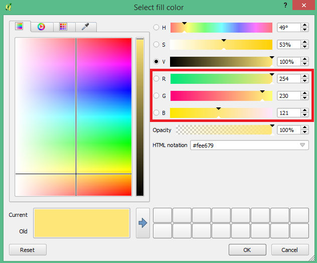

17. Use the values in Table below to change the colors for the remaining six land ownership classes.

<table>
<thead>
<tr>
  <th>Land Ownership Class</th>
  <th>Red-Green-Blue Color</th>
</tr>
</thead>
<tbody>
<tr>
  <td>BOR</td>
  <td>255-0-0</td>
</tr>
<tr>
  <td>DOD</td>
  <td>251-180-206</td>
</tr>
<tr>
  <td>FS</td>
  <td>179-222-105</td>
</tr>
<tr>
  <td>FWS</td>
  <td>127-204-167</td>
</tr>
<tr>
  <td>NPS</td>
  <td>177-137-193</td>
</tr>
<tr>
  <td>OTHER</td>
  <td>150-150-150</td>
</tr>
</tbody>
</table>

18. When finished, click OK on the Layer Properties for Federal Land Ownership. Turn off Sage-grouse Habitat by clicking the X next to the name in the Table of Contents. Your map should now resemble Figure below.

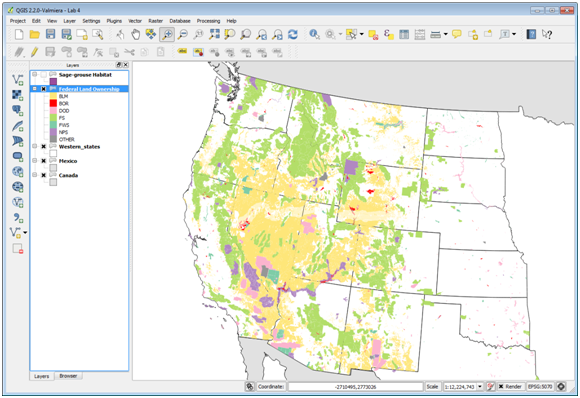

19.	Now you’ll set a background color for the map. Since states are filled with white, setting a background color of light blue will serve to represent the Pacific ocean. From the menu bar choose Project -> Properties. On the General tab click the white color patch next to Background color. Set the RBG value to: 225-255-255. Click OK on the Select Color window and OK on Project Properties to save the setting. Depending on your current map extent, the area east of the states layer may be blue now too. That is fine. For the final map we’ll be zoomed in so you won’t see that.

20. The states are white with a black border and serve to show non-federal land as white which is great. However, the state boundaries are obscured since State Boundaries are below Federal Land Ownership. Go to the Browser tab and add Western_states.shp to the map again. You can have multiple copies of layers for cartographic purposes. Drag the Western_states layer to the top of the Table of Contents. Go into the Layer Properties -> Style tab and click on Simple fill. Give the layer a Fill style of No Brush (Figure below). It will now just be the state outlines above Federal Land Ownership. Click OK to save.

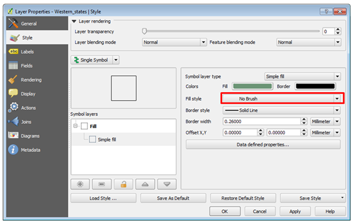

21. Your map should now resemble Figure below.

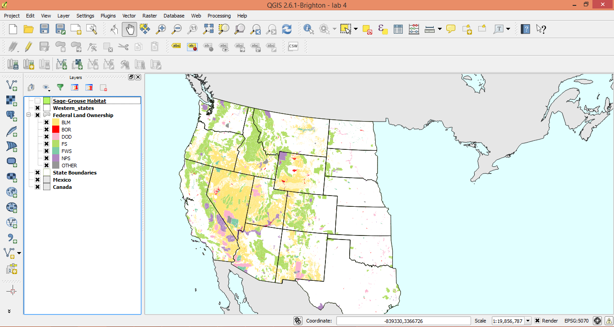

The last layer to work with is the Sage-grouse Habitat. You’ll make the Sage-grouse Habitat polygons have a cross hatch pattern. This will allow the map reader to see the land ownership data beneath. 

22. Open the Layer Properties for Sage-grouse Habitat. Click on Simple fill. Change the Fill to RGB 170-0-255. Change the Border to RGB 142-0-213. Make the Fill style FDiagonal. Finally change the Border width to 0.46 (Figure below). Click OK. Your map should now resemble Figure below. Save your project!

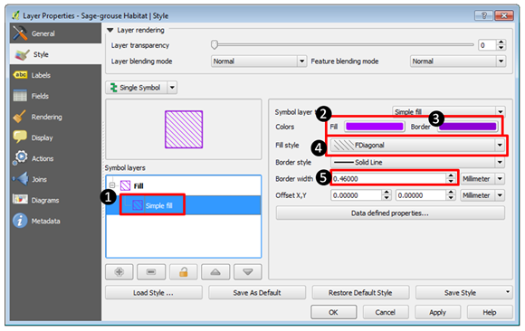

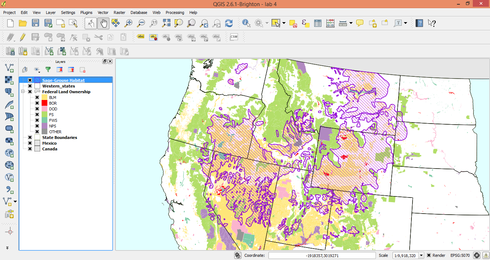

###	Task 3	Compose Map Deliverable

Now that all the data is well styled you can compose the map deliverable.

1. Zoom in tighter to the Sage-grouse Habitat data. Use the Zoom in tool  and drag a box encapsulating the sage-grouse habitat. Leave a little of the Pacific Ocean visible to the west to give some context (Figure below). As it turns out the data for Mexico is not needed. Sometimes you are given data that doesn’t end up being used.

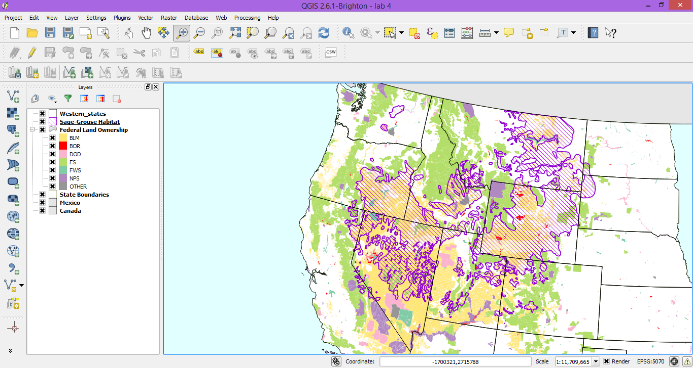

2. From the menu bar choose Project -> New Print Composer. Call the Composer “Lab 4- Sage-grouse Habitat” (Figure below). Click OK. The Print Composer will open. This is where you craft your map.

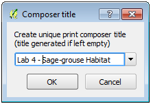

The Print Composer is an application window with many tools that allow you to craft a map. You may want to refer to the QGIS manual here: [http://www.qgis.org/en/docs/user_manual/print_composer/print_composer.html](http://www.qgis.org/en/docs/user_manual/print_composer/print_composer.html) The main window shows the piece of paper upon which the map will be designed. There are buttons along the left side of the window that allow you to add various map elements: map, scalebar, photo, text, shapes, attribute tables etc. Each item added to the map canvas becomes a graphic object that can be further manipulated (if selected) by the Item Properties tab on the right side of the composer. Across the top are buttons for exporting the composition, navigating within the composition and some other graphic tools (grouping/ungrouping etc.)

3. On the Composition tab you can specify details about the overall composition. Set the Presets to ANSI A (Letter). Set the Orientation to Landscape. Set the Export resolution to 300 DPI. These are listed as map requirements at the beginning of the lab. 

4. Using the Add new map button  drag a box on the map canvas where you’d like the map to go. Remember that you’ll need room for a title at the top of the page and a legend to the right of the map (Figure below). The map object can be resized after it’s added by selecting it and using the handles around the perimeter to resize.

Map extent helpful hints: Generally, the map will look as it does within QGIS Desktop. However, you may need to change the map extent in QGIS Desktop, go back to the Print Composer, select the map object and go to the Item Properties tab and choose Update Preview. While there, you can also choose to Set to Map Canvas Extent. If the map extent is still not quite right, you can use the Move Item Content button on the left side to pan the map contents around within the map object. It is normal to have some back and forth with QGIS Desktop and the Print Composer before getting the map just right.

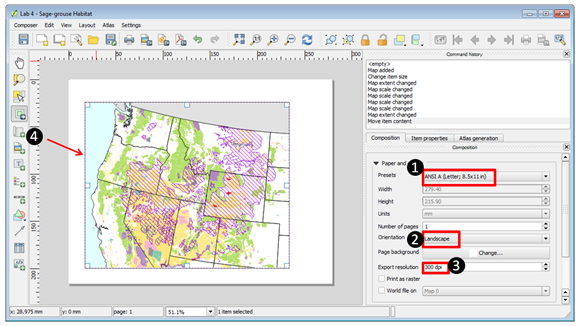

5. Now you will add the Title. Use the Add new label tool 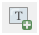 to drag a box all the way across the top of the composition. The text box can be resized after the fact by using the graphic handles. Use the Item Properties to type in the title. Refer to the map requirements at the beginning of the lab for the exact title wording. Click the Font button on the Item Properties to change the font to: Times New Roman, Bold, Size 36. Finally align the title horizontally to the Center (Figure below).

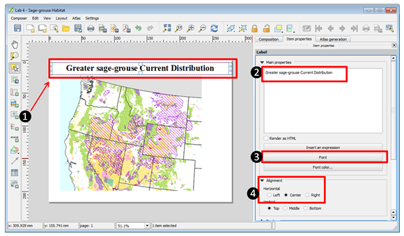

6. Now you’ll add a Legend. Use the Add new legend tool 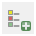 to drag a box on the right side of the map (Figure below).

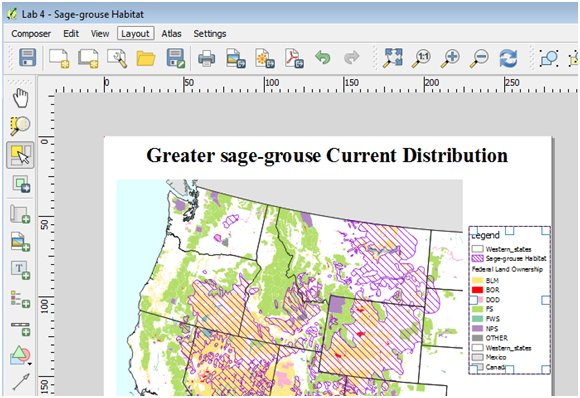

7. The upper most Western_states layer doesn’t need to appear in the legend, nor does Mexico. Western_states is there purely for cartographic reasons. Mexico doesn’t appear on the map. The Item Properties tab will be used to configure the legend (Figure below).

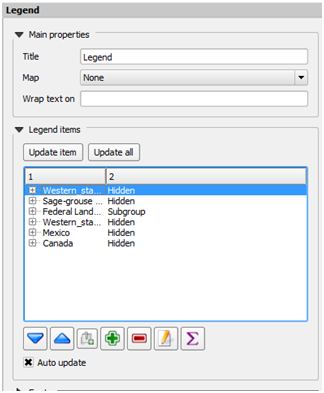

8. Select the Western_states layer and click the Delete item button 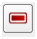 to remove it. Do the same for Mexico.

9. Expand the Federal Land Ownership layer. Click on the BLM class and click the Edit button 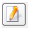. Change the name to “Bureau of Land Management”. Go through each remaining land ownership class and edit them to match Figure below.

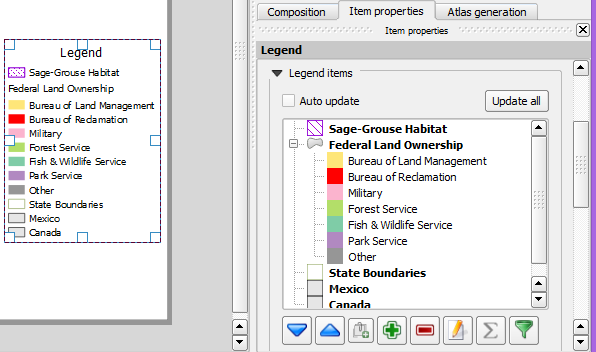

10. Add a neatline. A neatline is a frame around that map. Click the Add Rectangle tool (Figure below). Drag a box around the map object and legend. On the Item Properties tab click the Style Change button. Click Simple fill and give it a Fill style of No Brush. Give it a Border width of 1. Adjust the box so that it aligns with the map boundary.

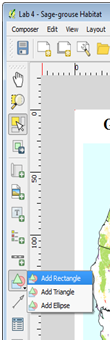

11. The last items to add are the data sources and date. Use the Add new label tool click in the lower right hand corner of the composition. Using the Item Properties type: 

Data Sources: The National Atlas & USFWS

Date: Month Day, Year

12. Make the font size 8. (Figure below)

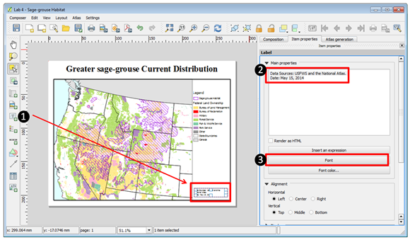

13. Congratulations your map is finished! The final step is to export it to a high resolution jpg image. 

14. Click the Export as image button 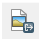.

15. Choose JPEG as the Save as type and save the image to your Lab 4 folder. Name the file “Lab4_Map.jpg” and click Save.

16. The final map should look like Figure below.

### 5. Conclusion

In this lab you’ve created a well-designed map using some of the cartography tools available in QGIS Desktop. You created a nice map highlighting federal land ownership within sage-grouse habitat for a client. This involved styling layers, styling layers by categorical attributes and crafting a map composition.

### 6. Discussion Questions

1. Export the final map as a high resolution jpg for your instructor to grade.

2. What are two ways to add vector data to QGIS Desktop?

3. How would a portrait orientation change the composition of the map? Describe how you would arrange the map elements.

4. No map is perfect. Critique this map. What do you like about it? What do  you dislike about it? How would you change this map to improve it? Would you add other data layers or add labels?

### 7. Challenge Assignment (Optional)

Another biologist working with black bears on the east coast heard about your great work on the sage-grouse map. She would like you to create a similar map for her. The data she is providing is in the Lab 4/Data/Challenge folder.

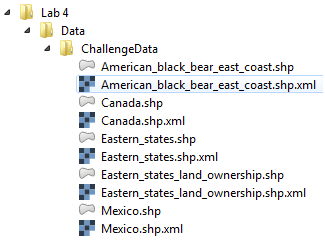

She also needs letter sized, color, map figure but that shows the relationship between black bear habitat and federal land ownership along the eastern seaboard. She is interested in seeing how much habitat is under federal versus non-federal ownership.

She is providing data from the US Fish and Wildlife Service depicted current occupied range for black bear on the east coast. She is also providing federal land ownership, state boundaries and country boundaries from the US National Atlas. The land ownership data has an attribute column describing which federal agency manages the land (AGBUR). This land ownership dataset has another category in the AGBUR field for Wilderness Areas called "Wild". These should be styled with a dark green.

She wants to have the habitat data shown so that the federal land ownership data is visible beneath. She would like each different type of federal land styled with standard Bureau of Land Management colors. The map should also include a title (“Black Bear Current Distribution”), a legend, data sources and the date. The map should be a high-resolution (300 dpi) jpg image. Perhaps you can incorporate some improvements to this map!

