# GST 101: Introduction to Geospatial Technology
## Lab 4 - Displaying Geospatial Data
### Objective – Explore and Understand How to Display Geospatial Data

Document Version: 3/4/2015

**FOSS4G Lab Author:**
Kurt Menke, GISP
Bird's Eye View GIS

**Original Lab Content Author:**
Richard Smith, Ph.D.  
Texas A&M University - Corpus Christi

---

The development of the original document is funded by the Department of Labor (DOL) Trade Adjustment Assistance Community College and Career Training (TAACCCT) Grant No.  TC-22525-11-60-A-48; The National Information Security, Geospatial Technologies Consortium (NISGTC) is an entity of Collin College of Texas, Bellevue College of Washington, Bunker Hill Community College of Massachusetts, Del Mar College of Texas, Moraine Valley Community College of Illinois, Rio Salado College of Arizona, and Salt Lake Community College of Utah.  This work is licensed under the Creative Commons Attribution 3.0 Unported License.  To view a copy of this license, visit http://creativecommons.org/licenses/by/3.0/ or send a letter to Creative Commons, 444 Castro Street, Suite 900, Mountain View, California, 94041, USA.  

This document was original modified from its original form by Kurt Menke and continues to be modified and improved by generous public contributions.

---

### 1. Introduction

In this lab, students will learn how to complete a well-designed map showing the relationship between species habitat and federal land ownership. The student will learn how to style GIS data layers in QGIS Desktop. They will then learn how to use the QGIS Print Composer to design a well crafted map deliverable. The final map will include standard map elements such as the title and map legend.

This lab will also continue to introduce students to the QGIS interface, as QGIS Desktop will be used throughout the course. It is important to learn the concepts in this lab as future labs will require the skills covered in this lab. 

This lab includes the following tasks:

+	Task 1 – Add data, organize map layers and set map projections.

+	Task 2 – Style data layers.

+	Task 3 – Compose map deliverable.

###	2.	Objective: Create a Map that Meets the Customer’s Requirements

Often times, you will be provided with a map requirements document from a coworker or customer. For this lab, the student will respond to a map requirements document from a customer who is writing a paper about the state of Greater sage-grouse habitat in the western United States. The map requirements from the customer are below.

Map Requirements from Customer:

Hi, my name is Steve Darwin. I am a wildlife biologist writing a paper on the state of Greater sage-grouse (see figure below) populations in the western United States. I need a letter sized, color, map figure that shows the relationship between current occupied Greater sage-grouse habitat and federal land ownership. I am interested in seeing how much habitat is under federal versus non-federal ownership.

I have been provided data from the US Fish and Wildlife Service depicted current occupied range for Greater sage-grouse. I also have federal land ownership, state boundaries and country boundaries from the US National Atlas. The land ownership data has an attribute column describing which federal agency manages the land (AGBUR). 

I want to have the habitat data shown so that the federal land ownership data is visible beneath. I would like each different type of federal land styled with standard Bureau of Land Management colors. The map should also include a title (“Greater sage-grouse Current Distribution”), a legend, data sources and the date. The map should be a high-resolution (300 dpi) jpg image.

I trust that you will get the figure right the first time, so please just submit the completed figures to the managing editor directly.

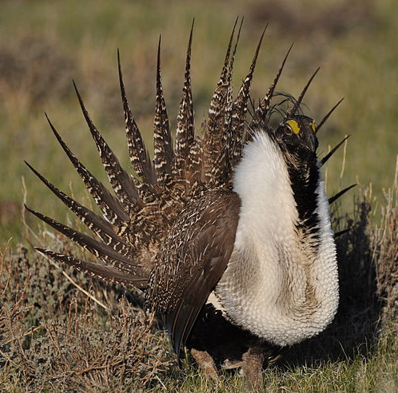

Image attribution: By Pacific Southwest Region from Sacramento, US (Greater Sage-Grouse) [CC BY 2.0 (http://creativecommons.org/licenses/by/2.0)], via Wikimedia Commons.

###	Task 1 - Add Data, Organize Map Layers and Set Coordinate Reference System

In this first task you will learn a new way to add data to QGIS Desktop. You will then set the projection for the map project, organize the data layers in the Table of Contents and change the layer names.

1. Open QGIS Desktop.  

In Lab 2 you learned how to add data to QGIS Desktop by using the Add Vector Data and Add Raster Data buttons. Now you will learn another method of adding data to QGIS Desktop. You will use the QGIS Desktop Browser panel.

2. Click View | Panels and make sure *Browser* is checked. The Browser panel will now be displayed.

*Note:* The Browser panel may be docked or floating, so it may not be in the same location as in the figures in this lab.

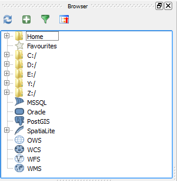

3. Using the file tree in the Browser window navigate to the Lab 4 data folder. 

4. Right click on the Lab 4 data folder and choose Add as a favourite from the context menu.

5. Sometimes when recent changes have been made, such as setting a folder as a favourite, the Refresh button needs to be pressed in order to see the changes. Click the Refresh button (highlighted in figure below).

6. Now expand Favourites near the top of the file tree in the Browser window by clicking the plus sign to the left. You will see the Lab 4 data folder listed. Setting the folder as a favourite allows you to quickly navigate to your working folder.

7. You will see 5 shapefiles in the lab data folder:

	+	Canada.shp
	+	Land\_ownership.shp
	+	Mexico.shp
	+	Sage\_grouse\_current\_distribution.shp
	+	Western\_states.shp

8. You can select them all by holding down the Ctrl key on your keyboard while left clicking on each shapefile. Select the five shapefiles (shown in figure below).

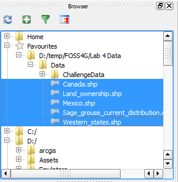

9. Drag the five selected shapefiles onto the map canvas from the Browser panel. This is another way of adding geospatial data to QGIS Desktop. QGIS Desktop should now look like figure below. The random colors that QGIS assigns to the layers may be different than the figure below but that is fine
	+ *Note:* If you do not see anything displayed in the map canvas, you may need to zoom to full extents of the map by pressing the Zoom Full button 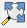. Alternatively, you can click View | Zoom Full.

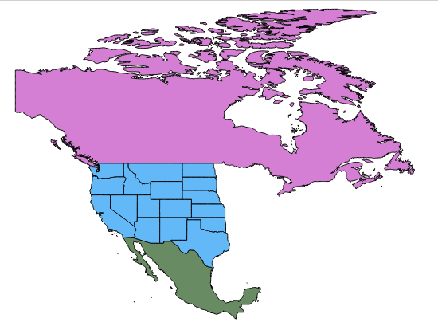

10. Let's save the QGIS project. Click on Project | Save from the menu bar. Navigate to your Lab 4 folder and save your project as Lab 4.

11. We have five layers in the map canvas, but currently all we can see are data for Canada, Mexico and the Western states. When you cannot see a dataset, one approach is to make sure the spatial extent of your map window covers that dataset. Right click on the Sage_grouse_current_distribution layer in the Layers panel, and choose Zoom to Layer from the context menu. This will zoom you into the extent of that dataset.

12. The map is now zoomed to the western United States, but we still cannot see anything that looks like habitat data (shown in figure below).

The data layers in the Layers panel are drawn in the order they appear in. So the layer that is on the top of the list in the Layers panel will be drawn on top of the other layers in the map view. Notice that the Western_states layer is in that top position. This mean that Western_states is covering up the Sage_grouse_current_distribution and Land_ownership data, since they are placed lower in the Layers panel. 

Let's change this drawing order.

13. Select the Land\_ownership data layer in the Layers panel and drag it to the top position. You will see a blue line as you drag this layer up the list.

14. Your map should now resemble the figure below.

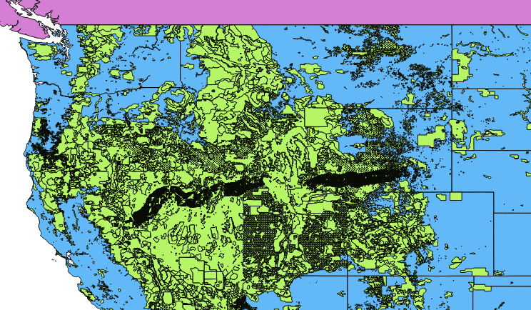

15. Now drag the Sage\_grouse\_current\_distribution layer into the top position. Your map should now resemble the figure below. 

Now all the data layers should be in the correct order. Typically, data layers will be organized with point data layers on top of line layers on top of polygon layers. Raster data layers are usually placed near the bottom.

With the layers in the best drawing order, let's turn our attention to the coordinate reference system for the map.

16. Note that the lower right hand corner of QGIS displays EPSG: 4269 OTF. This is the EPSG code for the coordinate reference system (CRS) the map is currently in and an indication that on-the-fly projection is enabled (shown in figure below).

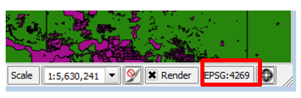

17. Click on Project | Project Properties from the menu bar to open the Project Properties window. 
18. Select the CRS tab. 

The current QGIS map CRS is listed at the bottom (shown in figure below). This is a detailed explanation of the maps CRS which is a geographic coordinate system using the NAD83 datum. This CRS makes the lower 48 look stretched out and distorted, so you’ll want to change the maps CRS into something that makes the lower 48 “look correct”. 

19. Make sure that the Enable ‘on the fly’ CRS transformation option is checked. Click OK to close the Project Properties window.

Since the Sage\_grouse\_current\_distribution layer is in an Albers projection, and the QGIS map is in a geographic CRS, that means that the Sage\_grouse\_current\_distribution layer is being projected on the fly into the geographic projection of the map.

20. Right click on the Sage\_grouse\_current\_distribution layer and choose Set Project CRS from Layer option on the context menu (Figure below). This will put the map into the Albers CRS of the Sage grouse layer. Note that the EPSG code in the lower right corner now reads 5070 for the Albers CRS. This CRS gives the western US an appearance we are more used to. Any other map layers not in Albers, will now be projected on the fly into Albers.

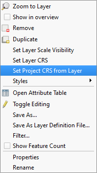

Now you will change the layer names in the Layers panel. The layer names match the names of the shapefiles by default. However, these names will appear on the legend. So you will always want to change these to proper names that your map reading audience will understand. 

21. Right click on the Sage\_grouse\_current\_distribution layer, and choose the Properties from the context menu, to open the Layer Properties window. Choose the General tab on the left.  Click in the box next to Layer name and change the name to Sage-grouse Habitat (shown in figure below). Click OK to close the Layer Properties window.
	+ Alternatively, you can right click on a layer in the Layers panel and choose Rename from the context menu to make the layer name editable directly in the Layers panel.

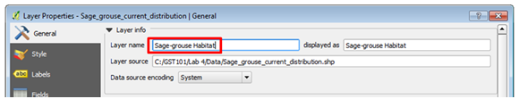

22. Change the other layers names as follows:

	+ Change Land ownership to Federal Land Ownership
	+ Change Western\_states to State Boundaries

23. Click the File | Save to save the changes you have made to your project.

### Task 2 - Style Data Layers

Now that you have set up your map, you will style your layers and begin to craft a well-designed map.

Visually you will want the land ownership and sage-grouse habitat to have the most weight. Canada and Mexico are there for reference but should fall to the background. You will make them both light gray.

1. Double-click on the Canada layer to open the Layer Properties window (this is another way to open Layer Properties). 

2. Click on the Style tab.

3. In the Symbol layers box click on Simple fill (reference figure below).

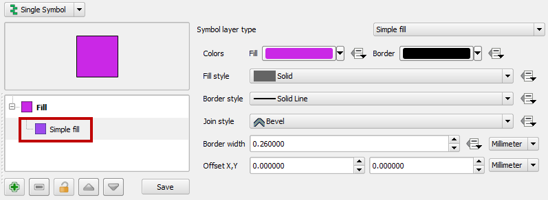

4. Find the Symbol layer type box on the right side of the window. This allows you to change both the fill and outline symbols for this polygon layer. Click on the colored box to the right of Fill (shown in figure below) to open the Color picker window.

You can pick existing Basic colors or define a color via A) hue, saturation and value (HSV) or B) red blue and green (RGB) values. Set the color to Hue: 0 Sat: 0% and Val: 90%. Make sure your Color picker window matches the figure below.

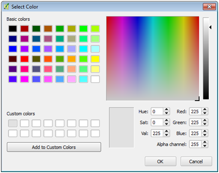

5. Click the button with the blue arrow to add the color to the custom color buttons. Click OK to close the Color picker window.

6. Back in the Layer Properties window, for the Border style, select Solid Line from the dropdown menu (shown in figure below).

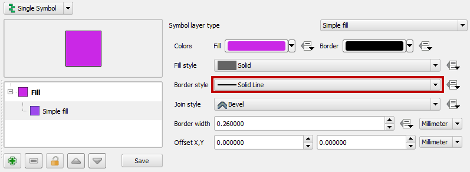

7. Click OK on the Layer Properties window to close and style the Canada layer.

8. Open Layer Properties for Mexico. Make Mexico look the same as Mexico. You can just choose the Custom color you just saved to save time.

Your map should now look like figure below.

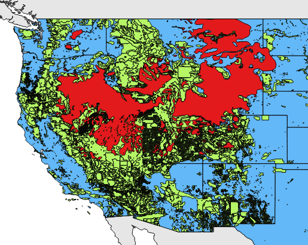

9. Using the same workflow, give the State Boundaries a white fill. You will be able to find white in the Basic colors palette.

Now you will style the Land Ownership layer. Instead of making the entire layer one color as you have done thus far, you will assign a unique color to each land managing agency. How do you know who is managing each parcel? This will be information contained in the attribute table. 

10. Right click on Federal Land Ownership layer in the Layers panel, and choose Open the Attribute Table from the context menu. 

There are 13 column of information. Can you find the one that contains the land manager?

11. Open the Layer Properties for the Federal Land Ownership layer and switch to the Style tab. So far you’ve used the default Single Symbol type. Now you will switch to Categorized. 

12. Click the drop down menu and change from Single Symbol to Categorized (Figure below).

Now you have the option of choosing an attribute column to symbolize the layer by. The column AGBUR is the one that contains the managing agency values. 

13. Click the drop down arrow and choose AGBUR for the Column. 

14. Click the Classify button (shown in figure below). This tells QGIS to sort through all the records in the table and identify all the unique values. Now you can assign a specific color to each class by double clicking on the color square.

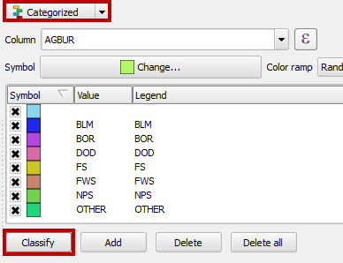

Notice that there is a symbol with no values. These are parcels with no values (NULL) in the AGBUR field. They represent private and state inholdings within federal lands. Since you are just interested in depicting federal land ownership you’ll delete that symbol class. 

15. Select that top symbol by clicking on it, and then click the Delete button below to remove that symbol. Now those parcels will not be included on the map.

For the remaining federal land ownership symbols you will use the BLM Standards Manual for land ownership maps [http://www.blm.gov/noc/st/en/business/mapstandards/colormod.html](http://www.blm.gov/noc/st/en/business/mapstandards/colormod.html). 

+ *Note:* A PDF of the BLM Map Color Standards is also available in your lab folder and is named BLM Map Color Standards.pdf.

The BLM has designated colors for each type of land ownership. When composing a map it is important to pay attention to industry specific standards. Following them will make the map more intuitive to the target audience. For example, people are used to seeing Forest Service land depicted in a certain shade of green.

16. To color BLM lands, double click on the color patch left of BLM in the Style window. The Symbol selector will open. 
17. Click on Simple fill. 
18. You will not want any border lines on these polygons. With such a complicated thematic polygon layer they are too visually distracting. Choose a Border style of No Pen. 
19. Click on the Fill style color patch to open the Color Picker window.
20. In the Color Picker window, change the Red, Green, and Blue values to 254 – 230 – 121 (shown in figure below). This will change the color to a specific shade of tan representing BLM lands. Click OK in the Color Picker window. Then click OK in the Symbol Selector to save the BLM style.

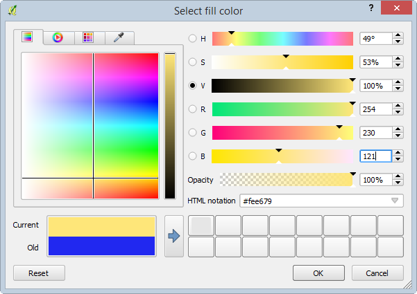

21. Use the values below to change the RGB colors for the remaining six land ownership classes. Also choose No pen for the border style.

+ BOR | 255-255-179
+ DOD | 251-180-206
+ FS | 179-222-105
+ FWS | 127-204-167
+ NPS | 177-137-193
+ OTHER | 150-150-150

22. When finished, click OK on the Layer Properties for Federal Land Ownership.
23. 
23. Turn off Sage-grouse Habitat by clicking the X next to the name in the Layers panel.

Your map should now resemble figure below.

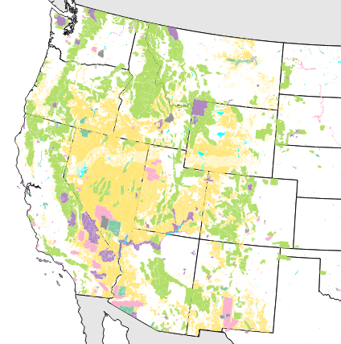

Now you will set a background color for the map. Since states are filled with white, setting a background color of light blue will serve to represent the Pacific Ocean.

24. From the menu bar choose Project | Project Properties. 
25. On the General tab, click the white color patch next to Background color to open the Color Picker window.
26. Set the RBG value to: **225**-255-255. 
27. Click OK on the Color Picker window and OK on Project Properties to save the setting. 

Depending on your current map extent, the area east of the states layer may be blue now too. That is fine. For the final map we will be zoomed in so you won’t see that.

The states are white with a black border and serve to show non-federal land as white which is great. However, the state boundaries are obscured since State Boundaries are below Federal Land Ownership. 

28. Go to the Browser panel and add Western\_states.shp to the map again. You can have multiple copies of layers for cartographic purposes. 
29. Drag the Western\_states layer to the top of the Layers panel. 
30. Open the Layer Properties window for the Western\_states layer and select the Style tab.
31. Click on Simple fill. 
32. Give the layer a Fill style of No Brush (see figure below). It will now just be the state outlines above Federal Land Ownership. 

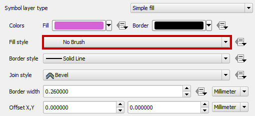

33. Click OK to save the style and close the Layer Properties window.
34. Your map should now resemble figure below.

The last layer to work with is the Sage-grouse Habitat. You will make the Sage-grouse Habitat polygons have a crosshatch pattern. This will allow the map reader to see the land ownership data beneath. 

35. Turn on the visibility for the Sage-grouse Habitat layer.
36. Open the Layer Properties for Sage-grouse Habitat. 
37. Click on Simple fill. 
38. Change the Fill color to RGB 170-0-255. 
39. Change the Border color to RGB 142-0-213. 
40. Make the Fill style FDiagonal. 
41. Finally change the Border width to 0.46 (reference settings in figure below).

42. Click OK.
43. Save your project!

Your map should now resemble Figure below.

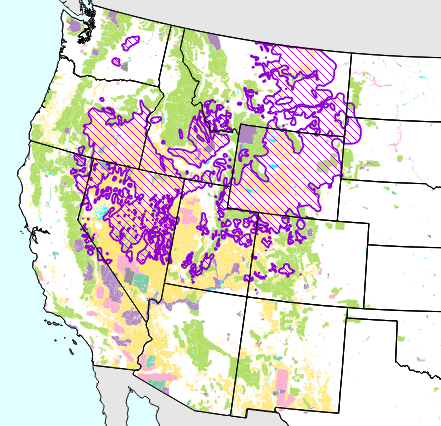

###	Task 3 - Compose Map Deliverable

Now that all the data is well styled you can compose the map deliverable.

1. Zoom in tighter to the Sage-grouse Habitat data.

	+ Use the Zoom in tool and drag a box encapsulating the sage-grouse habitat. Leave a little of the Pacific Ocean visible to the west to give some context (reference figure below).

As it turns out, the data for Mexico is not needed. Sometimes you are given data that does not end up being used, but is nice to have in case you do need it.

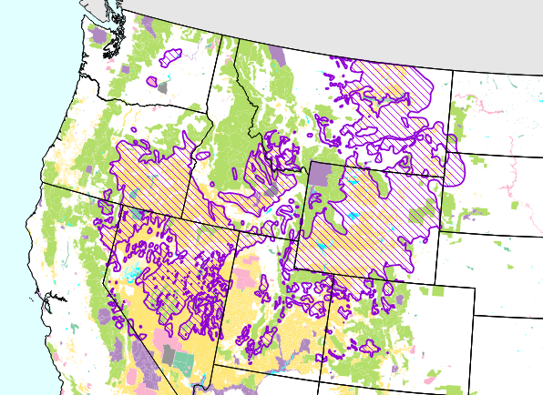

2. From the menu bar choose Project | New Print Composer. 
3. Name the Composer “Lab 4 - Sage-grouse Habitat” (shown in figure below). 

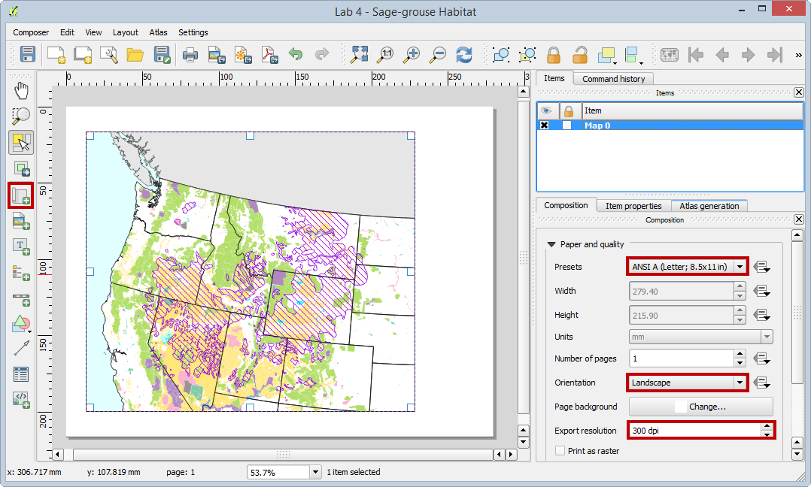

4. Click OK. The Print Composer will open. This is where you craft your map.

The Print Composer is an application window with many tools that allow you to craft a map. For detailed information about the Print Composer, refer to the QGIS manual: [http://www.qgis.org/en/docs/user_manual/print_composer/print_composer.html](http://www.qgis.org/en/docs/user_manual/print_composer/print_composer.html) 
The main window of the Print Composer displays the piece of paper upon which the map will be designed. There are buttons along the left side of the window that allow you to add various map elements: map, scale bar, photo, text, shapes, attribute tables, etc. Each item added to the map canvas becomes a graphic object that can be further manipulated (if selected) by the Items tab on the right side of the composer. Across the top are buttons for exporting the composition, navigating within the composition and some other graphic tools (grouping/ungrouping etc.)

5. On the Composition tab you can specify details about the overall composition. Set the Presets to ANSI A (Letter; 8.5x11 in). 
6. Set the Orientation to Landscape. 
7. Set the Export resolution to 300 DPI. 

(These are listed as map requirements at the beginning of the lab.)

8. Using the Add new map button 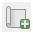 drag a box on the map canvas where you’d like the map to go. Remember that you’ll need room for a title at the top of the page and a legend to the right of the map (reference figure below).

The map object can be resized after it’s added by selecting it and using the handles around the perimeter to resize.

*Map extent helpful hints:* Generally, the map will look as it does within QGIS Desktop. However, you may need to change the map extent in QGIS Desktop, go back to the Print Composer and click the Refresh view button . It is normal to have some back and forth with QGIS Desktop and the Print Composer before getting the map just right.

Now you will add the title to your map.

9. Use the Add new label tool 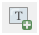 to drag a box all the way across the top of the composition. The text box can be resized after the fact by using the graphic handles.
10. Use the Item Properties to type in the title. Enter the title as 'Greater sage-grouse Current Distribution'. 
11. In the Items tab, select the title. This will change the properties available in the Item Properties tab.
12. In the Item Properties tab, click the Font button and change the font to: Times New Roman, Bold, Size 36.
13. Finally align the title horizontally to the Center of the map (see figure below).

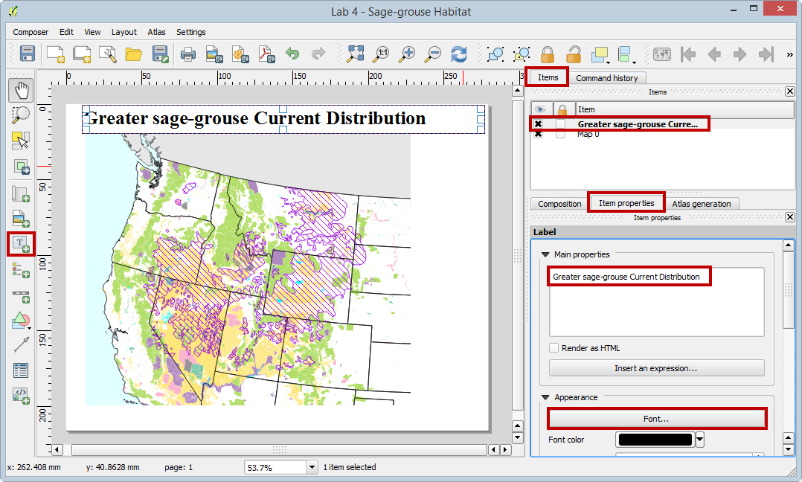

14. Now you will add a Legend. Use the Add new legend tool 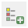 to drag a box on the right side of the map (shown in figure below).

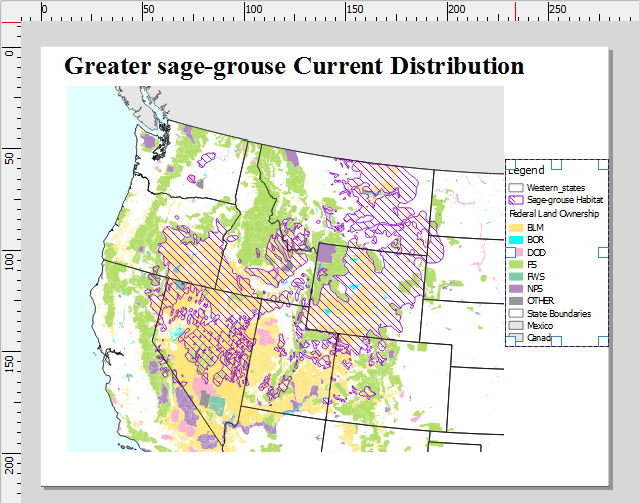

The upper most Western\_states layer does not need to appear in the legend, nor does Mexico. Western\_states is there purely for cartographic reasons and Mexico does not appear on the map. The Item properties tab will be used to configure the legend (see figure below).

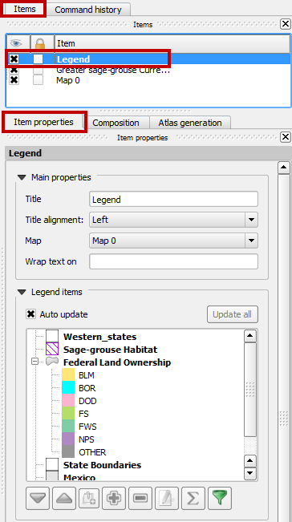

15. Uncheck Auto update. This will enable us to modify the legend, however, updates to the map on the map wil no longer be reflected in the legend unless we re-enable Auto update.
16. Select the Western\_states layer and click the Delete item button 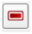 to remove it. Do the same for Mexico.
17. Expand the Federal Land Ownership layer. 
18. Click on the BLM class and click the Edit button 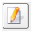. 
19. Change the name to “Bureau of Land Management”. Go through each remaining land ownership class and edit them to match Figure below.

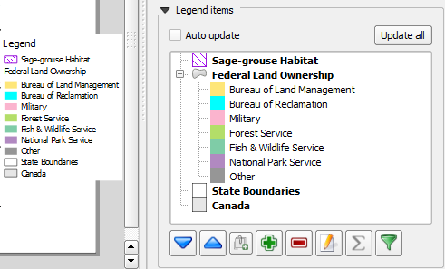

Now we will add a neatline around our map. 

20. Click the Add Rectangle tool (shown in figure below). 

21. Drag a box around the map object and legend. 
22. On the Item Properties tab, click the Style Change button. 
23. Click Simple fill and give it a Fill style of No Brush. 
24. Give it a Border width of 1. 
25. Adjust the box so that it aligns with the map boundary. 

You may find it necessary to lock the rectangle so you can move other map elements. To lock a map element and keep it from being selected, in the Items tab, check the box in the lock column as shown in the figure below.

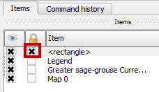

The last items to add to the map are the data sources and date. 

26. Click the Add new label tool.
27. Drag a box in the lower right hand corner of the composition. Using the Item Properties type: 

Data Sources: The National Atlas & USFWS

Date: Month Day, Year

28. Make the font Times New Roman and the font size 8.

Your map should resemble the figure below.

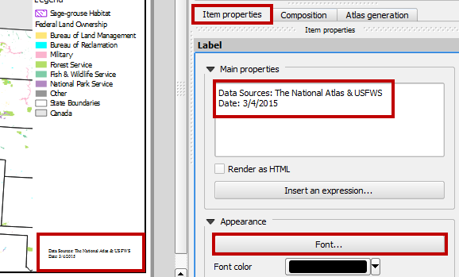

29. Congratulations your map is finished! The final step is to export it to a high-resolution jpg image. 

30. Click the Export as image button .

31. Choose JPEG as the Save as type and save the image to your Lab 4 folder. Name the file “Lab4_Map.jpg” and click Save.

32. The final map should look like Figure below.

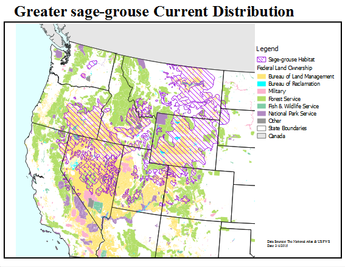

### 4. Conclusion

In this lab you created a well-designed map using some of the cartography tools available in QGIS Desktop. You created a nice map highlighting federal land ownership within sage-grouse habitat for a client. This involved styling layers, styling layers by categorical attributes and crafting a map composition.

### 5. Discussion Questions

1. Export the final map as a high-resolution jpg for your instructor to grade.

2. What are two ways to add vector data to QGIS Desktop?

3. How would a portrait orientation change the composition of the map? Describe how you would arrange the map elements.

4. No map is perfect. Critique this map. What do you like about it? What do  you dislike about it? How would you change this map to improve it? Would you add other data layers or add labels?

### 6. Challenge Assignment (optional)

Another biologist working with black bears on the east coast heard about your great work on the sage-grouse map. She would like you to create a similar map for her. The data she is providing is in the Lab 4/Data/Challenge folder.

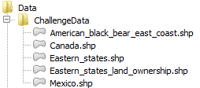

She also needs letter sized, color, map figure that shows the relationship between black bear habitat and federal land ownership along the eastern seaboard. She is interested in seeing how much habitat is under federal versus non-federal ownership.

She is providing data from the US Fish and Wildlife Service depicted current occupied range for black bear on the east coast. She is also providing federal land ownership, state boundaries and country boundaries from the US National Atlas. The land ownership data has an attribute column describing which federal agency manages the land (AGBUR). This land ownership dataset has another category in the AGBUR field for Wilderness Areas called "Wild". These should be styled with a dark green.

She wants to have the habitat data shown so that the federal land ownership data is visible beneath. She would like each different type of federal land styled with standard Bureau of Land Management colors. The map should also include a title (“Black Bear Current Distribution”), a legend, data sources and the date. The map should be a high-resolution (300 dpi) jpg image. Perhaps you can incorporate some improvements to this map!