# GST 101: Introduction to Geospatial Technology
## Lab 7 - Basic Geospatial Analysis Techniques
### Objective – Use Basic Spatial Analysis Techniques to Solve a Problem

Document Version: 3/17/2015

**FOSS4G Lab Author:**
Kurt Menke, GISP
Bird's Eye View GIS

**Original Lab Content Author:**
Richard Smith, Ph.D., GISP
Texas A&M University - Corpus Christi

---

The development of the original document is funded by the Department of Labor (DOL) Trade Adjustment Assistance Community College and Career Training (TAACCCT) Grant No.  TC-22525-11-60-A-48; The National Information Security, Geospatial Technologies Consortium (NISGTC) is an entity of Collin College of Texas, Bellevue College of Washington, Bunker Hill Community College of Massachusetts, Del Mar College of Texas, Moraine Valley Community College of Illinois, Rio Salado College of Arizona, and Salt Lake Community College of Utah.  This work is licensed under the Creative Commons Attribution 3.0 Unported License.  To view a copy of this license, visit http://creativecommons.org/licenses/by/3.0/ or send a letter to Creative Commons, 444 Castro Street, Suite 900, Mountain View, California, 94041, USA.

This document was original modified from its original form by Kurt Menke and continues to be modified and improved by generous public contributions.

---

### 1. Introduction

In this lab, the student will explore a small set of analysis tools available in QGIS Desktop. The student will conduct a spatial analysis and create a map of the results for a team of surveyors visiting National Geodetic Survey Monuments in Albuquerque, New Mexico.  The surveyors wish to have a map showing monuments within the Albuquerque city limits. They will use this map to plan their fieldwork for the week.

This lab includes the following tasks:

+ Task 1 – Data Preparation

+ Task 2 – Querying and Extracting Subsets of Data

+ Task 3 – Buffering and Clipping Data

+ Task 4 – Preparing a Map

### 2. - Objective: Use Basic Spatial Analysis Techniques to Solve a Problem

Conducting effective spatial analysis in a GIS does not require the use of extremely complex algorithms and methods.  By combining multiple simple spatial analysis operations, you can answer many questions and provide useful results.  Determining the order in which these simple spatial analysis operations are executed, is often the hardest part of conducing spatial analysis.  Additionally, data is rarely available in exactly the format and subset that you require.  A large part of almost all GIS projects is simply obtaining and preparing data for use.

In this lab, the student will utilize four basic geospatial analysis techniques: selection, buffer, clip, and dissolve.

+ Selection uses set algebra and Boolean algebra to select records of interest.

+ Buffer is the definition of a region that is less than or equal to a distance from one or more features.

+ Clip defines the areas for which features will be output based on a ‘clipping’ polygon.

+ Dissolve combines similar features within a data layer based on an attribute.

### Task 1 - Data Preparation

In this task, you will obtain GIS data for this lab by visiting several online GIS data portals, A) the National Geodetic Survey (NGS) website, B) City of Albuquerque GIS Department, C) the New Mexico Resource Geographic Information System (RGIS) and D) the Bernalillo County GIS Department. All of these websites provide free geospatial information.

Note: Copies of this data have already been obtained and are available in the Lab 7/Data/Raw Data folder. If you are unable to obtain the data yourself, you may skip to Task 2 and use the Raw Data.

### Task 1.1 - Obtain Shapefiles of NGS Monuments

We first want to go to the same National Geodetic Survey (NGS) website you visited in Lab 5. This time you will download a shapefile of the monuments in the Bernalillo County, New Mexico. This is the county in which Albuquerque is situated.

1. In a web browser, navigate to [http://www.ngs.noaa.gov](http://www.ngs.noaa.gov)

2. Click on the Survey Mark Datasheets link of the left side of the page.

3. Click the Shapefiles button.

4. Use the COUNTY retrieval method:

	a. Pick a State = New Mexico then click Get County List

	b. Pick a County = Bernalillo

	c. Data Type Desired = Any Vertical Control

	d. Stability Desired = Any Stability

	e. Compression Options = Send me all the Shapefiles compressed into one ZIP file…

	f. File Prefix = Bern

	g. (Leave all other options as the default values)

	h. Click the Submit button

	i. Click the Select All button

	j. Click Get Shapefile

	k. When the dialog box appears to save the ZIP file, save it into the Lab 7/Data/MyData directory.  

	l. Extract the ZIP file into the MyData directory.

### Task 1.2 - Obtain the Municipal Boundaries

Since you will identify monuments within the Albuquerque City limits, you’ll need an Albuquerque City limit dataset.  You will download the data from the City of Albuquerque GIS Department.

1. In a web browser, navigate to [http://www.cabq.gov/gis/geographic-information-systems-data](http://www.cabq.gov/gis/geographic-information-systems-data)

2. Scroll down until you find the Municipal Limits data.

3. Download the Boundaries shapefile to your folder.

	a. Save the ZIP file into your Lab 7/MyData directory.

	b. Extract this ZIP file into the lab directory.

### Task 1.3 - Obtain the Census Tract Boundaries

You will visit the RGIS clearinghouse. This is the main source for geospatial data for New Mexico. You will download census tract boundaries for Bernalillo County.
	
4. In a web browser, navigate to [http://rgis.unm.edu/](http://rgis.unm.edu/)

5. Click the Get Data button

6. In the folder tree underneath Filter data by Theme, expand Census Data

7. Expand 2010 Census

8. Click on 2010 Census Tracts

9. Download the Bernalillo County 2010 Census Tracts shapefile to your folder.

	a. Save the ZIP file into your Lab 7/MyData directory.
	
	b. Extract this ZIP file into the lab directory.

### Task 1.4 - Obtain Road Data

Finally, you will visit the Bernalillo County GIS Program to download a roads data set. This is the main source for geospatial data for New Mexico. You will download census tract boundaries for Bernalillo County.
	
10. In a web browser, navigate to [http://www.bernco.gov/Download-GIS-Data/](http://www.bernco.gov/Download-GIS-Data/)

11. Find the Download Shapefiles section

12. Find Road Inventory

13. Download the Road Inventory Zip file to your folder.

	a. Save the ZIP file into your Lab 7/MyData directory.

	b. Extract this ZIP file into the lab directory.

### Task 2 - Querying and Extracting Subsets of Data

Now that you have collected the necessary data, you will add it to a blank QGIS map document. Take a moment to familiarize yourself with the data and what information it contains. As with any project, you will have to do some data preparation to make it useful for the analysis.

### Task 2.1 - Working with coordinate reference systems

1. Open QGIS Desktop.

2. Using the Add Vector Layer button, add all four shapefiles to QGIS Desktop. (see figure below).

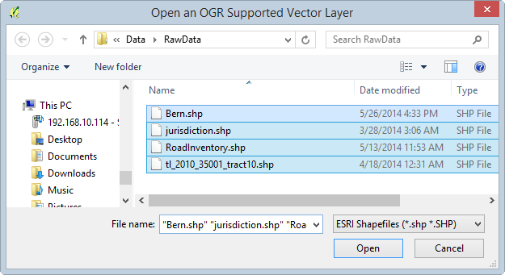

3. Organize the layers in the Layers panel so that the Bern monuments layer is on top, followed by the RoadInventory, tl_2010_35001_tract10 (tracts), and jurisdiction.

4. Save your project to the Lab 7 folder as Lab7.qgs

Does it look like all the layers are lining up together? Open the Layer properties for each layer and investigate their CRSs. Note that the Census Tracts (tl_2010_35001_tract10) and Monuments (Bern) are in geographic coordinates and the Road Inventory and jurisdiction are in the State Plane Coordinate System (SPCS).

5. From the menu bar choose Project | Project Properties.

6. Open the CRS tab and note that ‘on the fly’ CRS Transformation is checked. This is the default behavior if QGIS notices that Layers in the Layers panel have different CRSs. To change this default behavior, from the main menu bar, click Settings | Options | CRS tab and choose the default CRS settings.

7. While the CRS tab is still open choose NAD83(HARN)/New Mexico Central (ftUS) as the CRS for the map.

8. Click OK to set the project CRS.

Projecting on the fly is fine for cartographic purposes. However, when conducting a geospatial analysis, the data layers involved should be in the same CRS. Typically, data layers will also be clipped to the extent of the study area to reduce rendering and data processing time. These procedures are often referred to as normalizing your data. For the typical analysis, a majority of your time is spent obtaining data and normalizing it. Once all the data is organized and normalized, the analysis can proceed.

You will want to put all four layers into the same CRS for this analysis. You will put them all into the SPCS.

6. Right-click on the Bern layer in the Layers panel and choose Save As... from the contextual menu. This will open the Save vector layer as... window (shown in the figure below).
	
7. Click the Browse button to the right of Save as and save it into your lab folder as Bern_spcs.shp. (It is useful to have a naming convention for new data layers. Here you are including the CRS in the name of the copy.)
	
8. Click the Browse button for the CRS. The Coordinate Reference System Selector window will open.

9. From the Recently used coordinate reference systems choose NAD83(HARN) / New Mexico Central (ftUS) EPSG:2903 then click OK.
	
10. Check the box for Add saved file to map.
	
11. Click OK to save the new file in a different CRS.

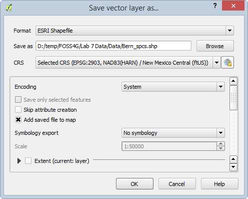

12. You no longer need the original Bern layer in your map. Right-click on the original Bern layer and choose Remove. Click OK on the Remove Objects window.

13. Repeat the above steps to save the Census Tracts (tl_2010_35001_tract10) layer in EPSG:2903.

14. Save your project.

### Task 2.2 - Dissolving Tract Boundaries into a County boundary

For the map, you will need a polygon that represents the county boundary. The tl_2010_35001_tract10_spcs Census tracts collectively define the county, so you will use the dissolve spatial analysis technique to create a county boundary from the Census tracts.

1. From the menu bar choose Vector | Geoprocessing Tools | Dissolve (reference figure below).

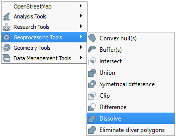

2. Set Input vector data to tl_2010_35001_tract10_spcs.

You can dissolve based on attributes. For example, if you had counties of the United States you could dissolve them based on the State name attribute and create a state boundaries layer. Here you will dissolve all the tract polygons into one to create the county boundary.

3. For Dissolve field choose –-- Dissolve all --- (at the bottom of the list).

4. Name the output shapefile Bernalillo_county.shp and save it to your lab folder (see figure below).

5. Make sure Add result to canvas is checked.

6. Click OK to run the Dissolve tool. Once the tool has executed, click Close.

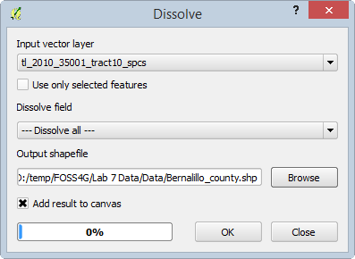

3. Remove the tl_2010_35001_tract10_spcs layer from the Layers panel. It was an intermediate dataset. All you need is the Bernalillo County Boundary.

4. Save your project.

### Task 2.3 - Select Monuments

You will want to filter the monuments so that you only have the ones with the orders and classes you’re interested in. Here you only want monuments that meet the following requirements:

+ Elevation Order = 1

+ Last recovered on or after 1995

+ Satellite Observations were used for monument coordinate determination.

+ a, b, and c are stored in these attribute columns:
	+ ELEV_ORDER
	+ LAST_RECV
	+ SAT_USE

(For information on what an elevation order and class is, visit [http://www.ngs.noaa.gov/heightmod/Leveling/](http://www.ngs.noaa.gov/heightmod/Leveling/))  

1. Double-click the Bern_spcs layer to open the Layer Properties.

2. Select the General tab.

3. Find the Feature subset area. This is where you can define the contents of a layer based on the attributes. It is a way to filter a layer.

4. Click the Query Builder button to open the Query Builder. Here you can write a SQL query to filter your data.

All the attribute fields are listed on the left. Below the fields are operators you can use to build your SQL expression. The expression is built in the blank window at the bottom. When building the expression, it is best to double-click fields and field values instead of manually typing them in so that you avoid syntax errors.

5. Double-click on the field ELEV_ORDER and it will appear in the expression window surrounded by double quotes.

6. Click the = sign under operators to add it to the expression.

7. Click the All button below Values to get a list of the values contained in that field.

8. Double-click the 1 value so that your expression reads "ELEV_ORDER" = '1’.

Since you want monuments that have both an elevation order of 1 and were last recovered on or after 1994 you will now use the AND operator. The AND operator selects records that meet conditions on both sides.

9. Double-click the AND button under Operators to add it to the expression.

10. After the AND operator create the portion of the expression dealing with LAST_RECV.

11. Add another AND operator and create the third portion of the expression dealing with the SAT_USE.

12. The final expression should look like the figure below.

2. Click the Test button. You should get a Query result of 47 rows. If you have a syntax error you will be notified and you’ll have to figure out where the error lies. Any extra tics (‘) or quotes (“) will throw an error. Click OK to dismiss the Query result dialog.

3. Click OK to set the Query and close the Query Builder window.

4. Click OK again to close the Layer Properties.

It is always a good idea to open the attribute table to ensure that the layer has been filtered the way you needed.

5. Open the attribute table for the Bern_spcs layer and verify that the table only includes 47 filtered features. This will be reported on the attribute table's title bar at the top.

5. With the data properly filtered, the map should now resemble the figure below.

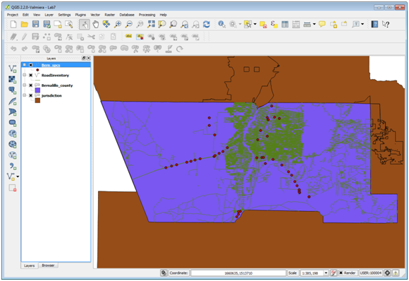

6. Save your project.

### Task 3 - Buffering and Clipping Data

Now that you have prepared the county boundary and the monuments layers, you will identify just the monuments within the Albuquerque City limits. First, you will create a filter on the jurisdiction layer and the RoadInventory layer as you did for monuments.

The jurisdiction layer covers much more than Bernalillo County. Albuquerque covers just a portion of the county and jurisdiction extends north and south of the county boundary.

1. Open the attribute table for jurisdiction. The first field ‘JURISDICTI’ has the city names. Notice that the majority consists of unincorporated areas. You can click the field header and you will see a small arrow appear. This lets you toggle back and forth between an ascending and descending sort of the records making it easier to find certain values. Close the Table.

3. Open the Layer properties for jurisdiction and go to the General tab.

4. Under Feature subset click the Query Builder button and create a query that selects only the JURISDICTI of Albuquerque.

5. Click OK on the Query Builder and close the Layer Properties.

6. In the Layers panel, drag jurisdiction above the Bernalillo County layer and turn off RoadInventory. Your map should resemble the figure below.

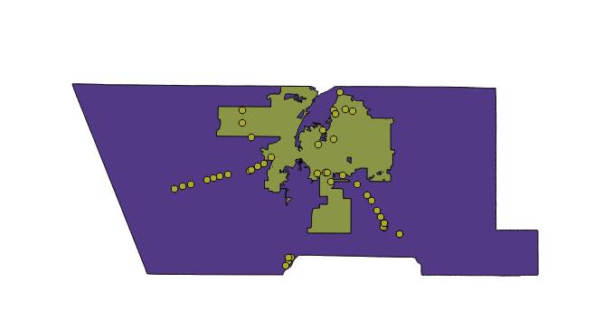

4. Open the attribute table for RoadInventory.

There is a lot of information in the RoadInventory shapefile. So far you have filtered a layer within QGIS, but left the data on disk the same. Now you will select the major roads and save them to a new shapefile. Considering the attribute table, what field would you use to select out major roads?

5. Click on the Select features using an expression button. 

A similar query window opens as when you are filtering a layer. Instead of the fields being listed on the left, here you have the Expression area. In the middle, the expression functions will be listed. If you scroll down though the functions tree, you will see that one category is Fields and Values.

6. Expand Fields and Values. 

7. Scroll down until you find the Class field.

8. Double-click on Class to add it to the Expression area.

9. Click the = operator.

9. Click all unique under Values.

10. Double-click the 'Major' value to add it to the expression. Your expression should now look like the figure below.

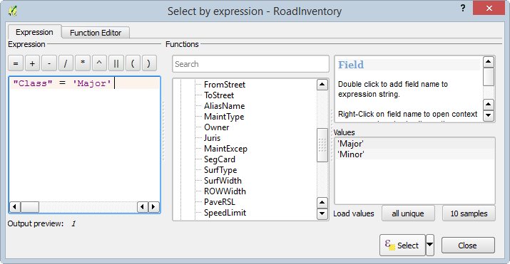

11. Click Select then Close the Select by Expression window.

You now have 4593 out of 37963 records selected. You can use the Toggle at the lower left corner of the attribute table to show just the selected set of records (see figure below).

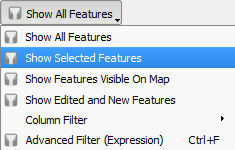

12. Close the attribute table.

8. Right-click on the RoadInventory layer and choose Save As….

9. Name the file 'Major_Roads.shp' and save it in your lab directory.

10. Check Save only selected features. The will only save the features currently selected to a new shapefile.

11. Verify that the dialog looks like the figure below. If so, click OK to save and add the layer to the map.

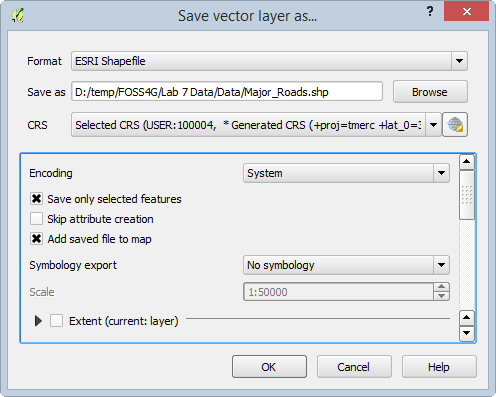

9. Remove RoadInventory from the Layers panel. All you need for your map is Major_Roads.

Now that you have the Albuquerque City limits isolated, you will buffer Albuquerque by one mile. Then you will be able to identify monuments that are either inside, or close to the city limits. Buffer is an operation that creates a new polygon layer that is a buffer distance from another layer.

10. From the menu bar choose Vector | Geoprocessing Tools | Buffer(s).

11. Set the Input vector layer to jurisdiction, which now equals the Albuquerque city boundary.

12. You will enter a Buffer distance in map units. The Project CRS is a State Plane Coordinate System (SPCS), which has feet for units. Therefore, to buffer the city boundary by a mile, enter the number of feet in a mile (5280).

13. Name the output Albuquerque_buffer.shp.

14. Check Add result to canvas.

15. Your tool should resemble the figure below. If so, click OK and then Close.

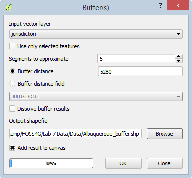

11. Drag the new buffer layer beneath jurisdiction and you will see that it is a one-mile buffer of the boundary.

Now that you have the search area for the selected monuments, you will use the Clip tool to clip the monument layer to the buffered city limits to create a new shapefile with only the monuments the surveyors should visit. The Clip tool acts like a cookie cutter. It cuts data out that falls within the clipping layer's boundary.

12. From the menu bar choose Vector | Geoprocessing Tools | Clip.

13. Set Input vector layer to Bern_spcs.

14. Set Clip layer to Albuquerque_buffer.

15. Name the output Albuquerque_monuments.shp.

16. Check Add result to canvas.

17. Your tool should resemble the figure below. If so, click OK and Close.

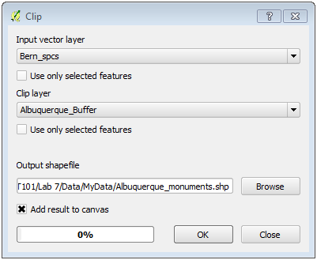

13. Remove Bern_spcs from the Layers panel.

Finally, you will label the monuments with the FeatureID attribute.

14. Open the Layer properties for the Albuquerque Monuments and select the Labels tab.

15. Check Label this layer with and choose FeatureId as the field.

16. Select the Buffer item and check Draw text buffer with the defaults (reference figure below). This will create a white halo around the labels, which can make them easier to read against a busy background.

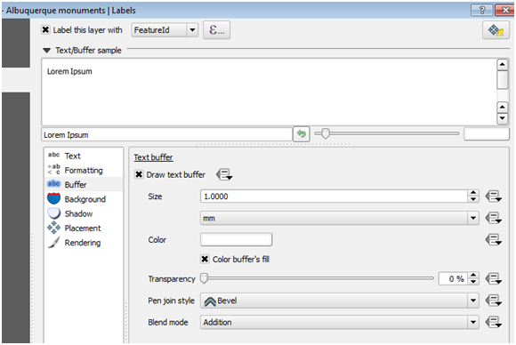

17. Click the Placement option and give a Distance of 2. This will offset the label from the point a bit giving more room for a bigger point symbol. Note that there are many options for label placement!

18. Click OK to set the labels for the monuments.

15. Label the major roads using the StreetName field. Under the Text tab, set a font size of 5.25.

16. On the Rendering tab, under Feature options area, choose Merge connected lines to avoid duplicate labels. This will clean up duplicate labels.

16. Change the style of the layer to make the map more attractive. Choose whatever colors you prefer. As an example, reference the map in the figure below.

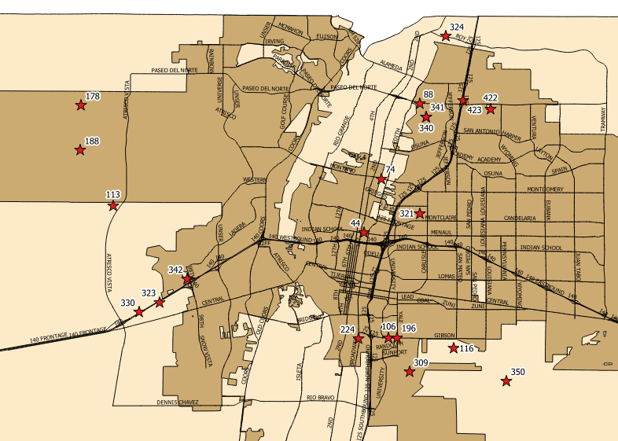

17. Save your project.

### Task 4 - Preparing a Map

Now that you have identified the locations of the monuments that the surveyors should visit, you will make a map of the result of your analysis. You should show the major roads to give them a general idea of how to access the monuments.

1. Rename the layers in the Layers panel to:

	a. Albuquerque Monuments

	b. Major Roads

	c. City of Albuquerque

	d. Bernalillo County

You do not necessarily have to show the buffer layer. It was just a means of identifying the monuments to map. However, you have cartographers license on that choice!

4. Zoom into the monuments layer so that you can show as much detail as possible.

5. Use the Print Composer to create a map layout.

6. Include the following map elements:

	+ Title: Albuquerque Vertical Control Monuments

	+ Legend

	+ Your Name

	+ Sources of Data

	+ Scale Bar: Use the Add Scale Bar button . QGIS uses map units for scale bars. Here our map units are feet. Therefore, to make a scalebar read in miles you need to enter a Map units per bar unit value of 5280 (the number of feet in a mile) (Figure below).

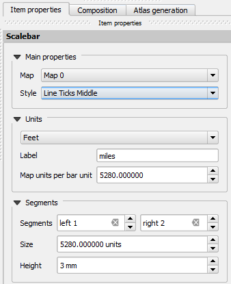

Below is an example of a completed map.

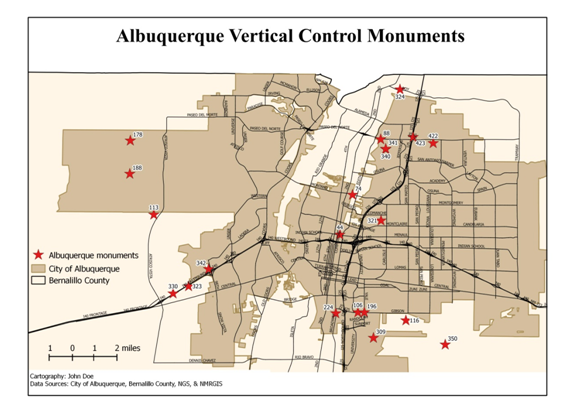

### 4. Conclusion
In this lab, you used several basic spatial analysis techniques to prepare data for analysis and conduct the analysis. You reprojected data, queried and extracted data, conducted a dissolve operation and used buffer and clip to identify the final set of monuments. While none of these individual operations are necessarily complex, the sequence in which they were combined allowed you to answer a spatial questions quickly and easily.

### 5. Discussion Questions

1. Export the final map for your instructor to grade.

2. You used different methods to create the major roads layer and the City of Albuquerque boundary. Why would you choose to filter a layer via a SQL query versus export a new layer based on a selection? What are the advantages/disadvantages to each?

3. Think of another use of a clip operation with the lab data.

4. Could you use the dissolve tool to create a municipal boundary data set whereby all the unincorporated areas were merged together? If so describe how you would set up the tool.

### 6. Challenge Assignment (optional)

The surveyors' work was streamlined and efficient due to your GIS analysis. They now have extra time to visit The Village of Tijeras while they are in town. Generate the same analysis and accompanying map for monuments meeting the same criteria for Tijeras. You can use all the same data so you will not have to download anything else.